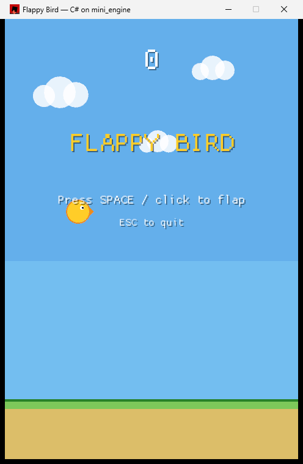

# mini_engine + Flappy Bird (C# scripting)

A **super-mini object-oriented game engine** in Rust, with **C# as its scripting
language**. The engine core (window, game loop, rendering) is Rust on
[`macroquad`](https://github.com/not-fl3/macroquad); the **entire Flappy Bird
game is written in C#** and driven by the engine through a thin FFI bridge.



> **New to this?** For a from-scratch explanation of how C# code can run on a
> Rust engine — what FFI is, how the .NET runtime is hosted, and how the two
> sides call each other — read
> [docs/how-csharp-scripting-works.md](docs/how-csharp-scripting-works.md).

## How the pieces fit

```
┌─────────────────────────────┐         ┌──────────────────────────────┐
│  Rust host (flappy.exe)      │         │  C# game (game_cs.dll)        │
│                              │         │                               │
│  mini_engine loop  ──────────┼── Update/Draw ──▶  FlappyScene          │
│  (macroquad window)          │         │   Bird / Pipe : GameObject    │
│                              │         │                               │
│  EngineApi (fn pointers) ◀───┼── DrawCircle / KeyPressed / … ──────────┤
│  → macroquad draw/input      │         │   via the Engine facade       │
└─────────────────────────────┘         └──────────────────────────────┘
       hosts the .NET runtime (hostfxr) and loads the C# assembly
```

- **Rust → C#:** the host hosts the .NET runtime via `hostfxr` (the
  [`netcorehost`](https://crates.io/crates/netcorehost) crate), resolves three
  `[UnmanagedCallersOnly]` entry points (`Init` / `Update` / `Draw`), and calls
  `Update`/`Draw` every frame from a `mini_engine` `Scene`.
- **C# → Rust:** at startup the host hands C# an `EngineApi` — a `#[repr(C)]`
  table of function pointers wrapping macroquad (draw, input, time, rng). C#
  game code calls them through a friendly `Engine` facade.

## Workspace layout

```
.
├── engine/            # mini_engine — the reusable Rust engine core
│   └── src/{object,world,scene,context,engine}.rs
├── flappy/            # the native host (flappy.exe)
│   ├── build.rs       #   auto-builds game_cs before the host
│   └── src/
│       ├── main.rs    #   .NET hosting + ScriptedScene + macroquad window
│       └── ffi.rs     #   EngineApi: the C ABI exposed to C#
└── game_cs/           # the game — 100% C#
    └── src/
        ├── EngineApi.cs    # struct mirroring flappy/src/ffi.rs (the contract)
        ├── Engine.cs       # Key/MouseButton + the Engine facade
        ├── Primitives.cs   # Vec2 / Rect / Color
        ├── GameObject.cs   # GameObject base class + Config constants
        ├── Bird.cs         # Bird : GameObject
        ├── Pipe.cs         # Pipe : GameObject
        ├── FlappyScene.cs  # Ready → Playing → GameOver, scoring, collisions
        └── Interop.cs      # [UnmanagedCallersOnly] Init/Update/Draw
```

The Rust `mini_engine` (`GameObject` / `World` / `Scene` / `Engine`) is still a
complete OO engine on its own; here the scene's behaviour is simply *scripted*
from C# via the `ScriptedScene` shim in [flappy/src/main.rs](flappy/src/main.rs).

## Prerequisites

- **Rust** (stable) — `cargo`
- **.NET SDK 10** — `dotnet` on `PATH` (the C# project targets `net10.0`)

## Build & run

One command — `build.rs` compiles the C# project first, then the host:

```bash
cargo run -p flappy --release
```

Equivalent manual steps:

```bash
dotnet build game_cs -c Release      # produces game_cs.dll + .runtimeconfig.json
cargo run -p flappy --release
```

By default the host looks for the assembly at
`game_cs/bin/Release/net10.0/`. Override with the `FLAPPY_MANAGED_DIR`
environment variable if you build elsewhere.

### Controls

- **Space / Up arrow / Left click** — flap
- **Esc** — quit

Fly through the gaps; each pipe passed scores a point. Hitting a pipe or the
ground ends the run, and your best score persists across retries in a session.

## Extending the bridge

To expose a new engine capability to C#:

1. Add an `extern "C"` function and a field to `EngineApi` in
   [flappy/src/ffi.rs](flappy/src/ffi.rs).
2. Add the matching `delegate* unmanaged[Cdecl]<…>` field **in the same position**
   to `EngineApi` in [game_cs/src/EngineApi.cs](game_cs/src/EngineApi.cs).
3. Surface it on the `Engine` facade in [game_cs/src/Engine.cs](game_cs/src/Engine.cs).

The field order is the ABI contract — keep both `EngineApi` structs in lockstep.
