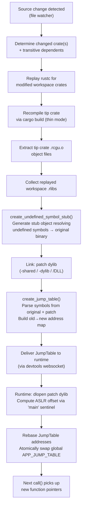

# Subsecond DLL Support: Engineering Investigation and Design Assessment

**Date of investigation:** August 4, 2026  
**Repository analyzed:** <https://github.com/DioxusLabs/dioxus>  
**Branch:** `main`  
**Key commit context:** Analyzed source as of commit near `2cd5245` ("update to edition 2024 (#5502)")  
**Crate version:** Subsecond is not independently versioned; it follows the Dioxus workspace version (0.7-dev at time of analysis).

---

## Table of Contents

1. [Subsecond Architecture](#1-subsecond-architecture)
2. [Executable-Only Assumptions](#2-executable-only-assumptions)
3. [What "DLL Support" Should Mean](#3-what-dll-support-should-mean)
4. [Changes Required by Subsystem](#4-changes-required-by-subsystem)
5. [`dylib` versus `cdylib`](#5-dylib-versus-cdylib)
6. [Implementation Approaches](#6-implementation-approaches)
7. [Affected Source Files and Modules](#7-affected-source-files-and-modules)
8. [Implementation Plan](#8-implementation-plan)
9. [Design Validation Experiments](#9-design-validation-experiments)
10. [Engineering Effort Estimates](#10-engineering-effort-estimates)
11. [Blockers and Fundamental Limitations](#11-blockers-and-fundamental-limitations)
12. [Comparison with Related Systems](#12-comparison-with-related-systems)
13. [Final Engineering Recommendation](#13-final-engineering-recommendation)

---

## 1. Subsecond Architecture

### 1.1 Overview

Subsecond is a two-part system: a **runtime library** (the `subsecond` crate) linked into the user's application, and a **CLI build orchestrator** (the `dioxus-cli` crate, invoked via `dx serve --hotpatch`) that compiles patches and delivers them to the running application.

The fundamental insight of Subsecond is: **do not modify process memory**. Instead of overwriting instructions in-place (like `detour`-style libraries), Subsecond maintains an indirect **jump table**. Every hot-reloadable function call goes through this table, which can be atomically swapped to point at new implementations.

### 1.2 The Patching Pipeline



### 1.3 Detailed Pipeline Steps

#### 1.3.1 Source Change Detection

The Dioxus CLI file watcher monitors the workspace directory. When a `.rs` file changes, it maps the file to its owning Cargo crate via `workspace_dependents_of()`. The change triggers a **thin rebuild** (`BuildMode::Thin`).

**Source:** `packages/cli/src/build/builder.rs`, function `patch_rebuild()`.

#### 1.3.2 Workspace Crate Replay

Modified workspace crates (excluding the tip crate) are recompiled by replaying their original `rustc` invocations captured during the initial "fat" build. The captured `RustcArgs` (including environment variables, working directory, and all CLI flags) are replayed directly. This overwrites the `.rlib` on disk with updated object code.

**Source:** `packages/cli/src/build/link.rs`, function `compile_dep_crate()`.

The replay order is determined by a topological sort (Kahn's algorithm) of the workspace dependency graph, ensuring dependencies compile before dependents.

**Source:** `packages/cli/src/build/link.rs`, function `workspace_hotpatch_replay_order()`.

#### 1.3.3 Tip Crate Recompilation

The tip crate (the one containing `main.rs`) is recompiled via `cargo build` with the Subsecond wrapper intercepting `rustc` and linker invocations. The resulting `.rcgu.o` (codegen unit object) files are extracted from the linker arguments.

**Source:** `packages/cli/src/build/link.rs`, function `compile_workspace_hotpatch()`.

**Key detail:** The tip crate is identified by `self.tip_crate_name()` which returns the name of the bin target's crate. The tip crate objects are always `.rcgu.o` files from the linker args, and they are always temporary files (deleted after linking).

#### 1.3.4 Stub Object Generation

Before linking, `create_undefined_symbol_stub()` is called. This function:

1. Reads every object file and `.rlib` that will be linked.
2. Collects all undefined symbols.
3. For each undefined symbol, looks it up in the **HotpatchModuleCache** (which holds the symbol table from the original fat binary).
4. Generates a new object file containing:
   - **Text stubs:** Small assembly trampolines that jump to the known address of the original function (using `movabs`+`jmp` on x86_64 Windows, `jmp [rip+0]` on System V, `LDR`+`BR` on AArch64, etc.).
   - **Data stubs:** For data symbols (`__imp_`-prefixed on Windows), a pointer to the resolved address.
   - **TLS stubs:** For thread-local symbols, initialized TLS data sections using the original `.tdata`/`__thread_data` contents.

**This is the mechanism that allows the patch dylib to call back into the original binary without the original binary being a link-time dependency.** The stub object provides "fake" definitions that jump to the actual runtime addresses.

**Source:** `packages/cli/src/build/patch.rs`, function `create_undefined_symbol_stub()`.

**Critical executable-only assumption:** The stub generator uses `main_sentinel()` to compute the ASLR slide. It assumes the original binary *is the executable* and that its symbol table contains the `main` symbol.

#### 1.3.5 Patch Linking

The patch is linked as a **shared library** (dylib/so/dll), not as an executable:

| Platform | Linker flag | Output extension |
|----------|------------|-----------------|
| macOS/iOS | `-Wl,-dylib` | `.dylib` |
| Linux/Android | `-shared` | `.so` |
| Windows MSVC | `/DLL` | `.dll` |
| WASM | `--pie --experimental-pic` | `.wasm` |

The linker inputs are:
- Tip crate `.rcgu.o` files (newly recompiled)
- Replayed workspace `.rlib` files
- The generated `stub.o` object
- Platform `.dylib`/`.so` dependencies

**Source:** `packages/cli/src/build/link.rs`, function `compile_workspace_hotpatch()` and `thin_link_args()`.

The output is named `lib{executable_name}-patch-{timestamp}.{ext}` and placed next to the main executable.

**Source:** `packages/cli/src/build/link.rs`, function `patch_exe()`.

#### 1.3.6 Jump Table Creation

After linking, a **JumpTable** is built by comparing symbol tables of the original binary and the patch:

**Windows:** Uses the `pdb` crate to read `.pdb` files. Collects `Public` symbols from both the original and patch PDBs. Maps old RVA → new RVA.

**Source:** `packages/cli/src/build/patch.rs`, function `create_windows_jump_table()`.

**Linux/macOS (native):** Uses the `object` crate to parse ELF/Mach-O symbol tables directly from the binaries. Maps old symbol address → new symbol address for symbols present in both.

**Source:** `packages/cli/src/build/patch.rs`, function `create_native_jump_table()`.

**WASM:** Uses the `walrus` crate to manipulate the WASM module. Resolves GOT.func and GOT.mem imports from the patch against the base module's indirect function table and data segments.

**Source:** `packages/cli/src/build/patch.rs`, function `create_wasm_jump_table()`.

The `JumpTable` structure (from `subsecond-types`):

```rust
pub struct JumpTable {
    pub lib: PathBuf,           // Path to the patch dylib
    pub map: AddressMap,        // HashMap<old_addr, new_addr> (unrebased)
    pub aslr_reference: u64,    // Compile-time address of 'main' in original binary
    pub new_base_address: u64,  // Compile-time address of 'main' in patch
    pub ifunc_count: u64,       // WASM: number of indirect function table entries
}
```

**Source:** `packages/subsecond/subsecond-types/src/lib.rs`.

#### 1.3.7 Runtime Patch Application

The runtime receives the `JumpTable` (via the Dioxus devtools websocket protocol) and calls `apply_patch()`:

1. **dlopen** the patch dylib (`libloading::Library::new(&table.lib)`).
2. Compute the **ASLR slide** for the original executable: `aslr_reference() - table.aslr_reference`.
   - `aslr_reference()` dynamically looks up `main` via `dlsym(RTLD_DEFAULT, "main")` (Unix) or `GetProcAddress(GetModuleHandleA(NULL), "main")` (Windows).
3. Compute the **offset** for the patch: look up `main` in the loaded patch dylib, subtract `table.new_base_address`.
4. Rebase the jump table: for every `(old_addr, new_addr)` pair, apply `old_addr += old_offset` and `new_addr += new_offset`.
5. Atomically store the new `JumpTable` into the global `APP_JUMP_TABLE` atomic pointer.

**Source:** `packages/subsecond/subsecond/src/lib.rs`, function `apply_patch()` and `aslr_reference()`.

#### 1.3.8 Function Call Redirection

When user code calls `subsecond::call(|| { ... })`, the `HotFn::try_call()` method:

1. Checks if `debug_assertions` is enabled (no-op in release).
2. Looks up the function pointer in the global `APP_JUMP_TABLE`.
3. If found, calls the new implementation via the jump table entry.
4. If not found (function unchanged), calls the original implementation.

**Source:** `packages/subsecond/subsecond/src/lib.rs`, function `HotFn::try_call()`.

### 1.4 The "Tip Crate" Concept

The tip crate is the binary crate containing `main.rs`. Subsecond explicitly documents this limitation:

> "Subsecond currently only patches the 'tip' crate — ie the crate in which your `main.rs` is located."

**Source:** `packages/subsecond/subsecond/src/lib.rs`, doc comment at the top of the file.

The tip crate is special because:
- Its `.rcgu.o` files are the ones that go directly into the linker invocation (not via `.rlib`).
- The `main` symbol lives there, serving as the ASLR sentinel.
- The fat binary is the output of linking the tip crate as an executable.
- Patches are produced by re-linking the tip crate's objects as a shared library.

The tip is tracked throughout the CLI by `self.build.tip_crate_name()` and `self.build.tip_package_name()` (which may differ when a `[[bin]]` target has a different name than its package).

**Source:** `packages/cli/src/build/builder.rs`, function `patch_rebuild()`.

### 1.5 The HotpatchModuleCache

The cache stores the symbol table of the original fat binary, parsed once during the initial build and reused across all subsequent patches:

| Platform | Storage format | Parser |
|----------|---------------|--------|
| Windows | `.pdb` file | `pdb` crate |
| Linux/ELF | In-binary symbol table | `object` crate |
| macOS/Mach-O | In-binary symbol table | `object` crate |
| WASM | In-module linking section + ifunc table | `walrus` + `wasmparser` |

Additionally stores:
- `tls_init_data`: Raw `.tdata`/`__thread_data` bytes for TLS symbol stubs.
- `tls_init_sizes`: Map from `$tlv$init` symbol name to `(offset, size)` (macOS-specific, since Mach-O nlist has no size field).

**Source:** `packages/cli/src/build/patch.rs`, struct `HotpatchModuleCache` and `HotpatchModuleCache::new()`.

### 1.6 Architecture Diagram

```
┌─────────────────────────────────────────────────────────────────┐
│                        BUILD TIME (CLI)                         │
│                                                                 │
│  ┌──────────┐   ┌──────────────┐   ┌─────────────────────────┐ │
│  │ File     │   │ Workspace    │   │ Patch Linker            │ │
│  │ Watcher  │──▶│ Crate Replay │──▶│ (cc/lld/link.exe)       │ │
│  │          │   │ (rustc)      │   │ -shared/-dylib /DLL     │ │
│  └──────────┘   └──────────────┘   │ Inputs:                  │ │
│                                     │  • tip .rcgu.o files    │ │
│                                     │  • replayed .rlibs      │ │
│                                     │  • stub.o (trampolines) │ │
│                                     │  • platform dylibs      │ │
│                                     └───────────┬─────────────┘ │
│                                                 │               │
│                                     ┌───────────▼─────────────┐ │
│                                     │ Jump Table Creation     │ │
│                                     │ (PDB/ELF/Mach-O parse)  │ │
│                                     │ old_addr → new_addr map │ │
│                                     └───────────┬─────────────┘ │
│                                                 │               │
└─────────────────────────────────────────────────┼───────────────┘
                                                  │
                    Devtools WebSocket            │
                                                  │
┌─────────────────────────────────────────────────┼───────────────┐
│                        RUNTIME (App)            │               │
│                                                 │               │
│  ┌──────────────────────────────────────────────▼────────────┐  │
│  │ apply_patch()                                             │  │
│  │  1. dlopen patch dylib                                   │  │
│  │  2. Compute ASLR offset via dlsym("main") - aslr_ref     │  │
│  │  3. Rebase JumpTable                                     │  │
│  │  4. Atomic swap APP_JUMP_TABLE                           │  │
│  └──────────────────────────────────────────────────────────┘  │
│                                                 │               │
│  ┌──────────────────────────────────────────────▼────────────┐  │
│  │ subsecond::call(|| { ... })                               │  │
│  │  → HotFn::try_call()                                      │  │
│  │    → Look up fn ptr in APP_JUMP_TABLE                     │  │
│  │    → If found: call new impl (transmuted fn ptr)          │  │
│  │    → If not: call original impl                           │  │
│  │    → If stale: emit HotFnPanic → unwind to next call()    │  │
│  └──────────────────────────────────────────────────────────┘  │
└─────────────────────────────────────────────────────────────────┘
```

### 1.7 Platform-Specific Runtime Details

**Windows (`aslr_reference`):**
```rust
GetProcAddress(GetModuleHandleA(std::ptr::null()), c"main".as_ptr())
```
Uses `GetModuleHandleA(NULL)` to get the handle to the main executable, then resolves `main` via `GetProcAddress`.

**Linux/macOS (`aslr_reference`):**
```rust
libc::dlsym(libc::RTLD_DEFAULT, c"main".as_ptr())
```
Uses `RTLD_DEFAULT` to search the global symbol namespace for `main`.

**Source:** `packages/subsecond/subsecond/src/lib.rs`, function `aslr_reference()`.

---

## 2. Executable-Only Assumptions

This section catalogs every important assumption that ties Subsecond to patching only the top-level executable crate. For each assumption, I document the source location, what is assumed, why it works for executables, and why it fails for DLLs.

### Assumption 1: The "Tip Crate" is Always a Binary Crate

| Property | Detail |
|----------|--------|
| **Source file** | `packages/cli/src/build/link.rs` |
| **Key code** | `self.tip_crate_name()` — returns the name of the `bin` target |
| **What it assumes** | The patch target has a `main.rs` and is built as a `bin` crate type |
| **Why it works for executables** | Every Rust executable has exactly one bin crate with a `main` function |
| **Why it fails for DLLs** | A `cdylib`/`dylib` crate has `lib.rs`, not `main.rs`. It may not export `main`. The tip concept collapses |
| **Limitation type** | **Architectural** — the entire build pipeline is organized around the tip crate |

### Assumption 2: `main` is the ASLR Sentinel

| Property | Detail |
|----------|--------|
| **Source file** | `packages/subsecond/subsecond/src/lib.rs`, function `aslr_reference()` |
| **Key code** | `dlsym(RTLD_DEFAULT, "main")` / `GetProcAddress(GetModuleHandleA(NULL), "main")` |
| **What it assumes** | The symbol `main` exists in the executable's export table and is a stable reference point |
| **Why it works for executables** | `main` is always exported from executables on all platforms (for CRT startup) |
| **Why it fails for DLLs** | (a) A DLL does not have `main`. (b) `GetModuleHandleA(NULL)` returns the EXE, not the DLL. (c) `RTLD_DEFAULT` searches the global namespace, but `main` is in the EXE, not the DLL |
| **Limitation type** | **Incidental** — the sentinel concept generalizes; a different sentinel symbol or base-address query can replace `main` |

### Assumption 3: `main` is the Patch Base Address Reference

| Property | Detail |
|----------|--------|
| **Source file** | `packages/cli/src/build/patch.rs`, functions `create_windows_jump_table()`, `create_native_jump_table()` |
| **Key code** | `new_name_to_addr.get("main")` — computes `new_base_address` from patch's `main` symbol |
| **What it assumes** | The patch dylib contains `main` and its address is a reliable base reference |
| **Why it works for executables** | The patch is built from the tip crate which contains `main` |
| **Why it fails for DLLs** | A DLL patch would not contain `main`; a different base reference is needed |
| **Limitation type** | **Incidental** — `main_sentinel()` already exists as an abstraction; it can be generalized |

### Assumption 4: The Original Binary is an Executable, Not a Shared Library

| Property | Detail |
|----------|--------|
| **Source file** | `packages/cli/src/build/patch.rs`, function `create_undefined_symbol_stub()` |
| **Key code** | `let aslr_ref_address = cache.symbol_table.get(main_sentinel(triple))...` |
| **What it assumes** | The symbol table cache is built from an executable binary with `main` |
| **Why it works for executables** | The cache is built from the fat-linked executable |
| **Why it fails for DLLs** | The cache would need to be built from the original DLL, which does not have `main`. The ASLR slide for the DLL is different from the EXE's slide |
| **Limitation type** | **Architectural** — the entire stub resolution pipeline assumes a single "original binary" with `main` |

### Assumption 5: `GetModuleHandleA(NULL)` Returns the Patch Target

| Property | Detail |
|----------|--------|
| **Source file** | `packages/subsecond/subsecond/src/lib.rs`, function `aslr_reference()` (Windows branch) |
| **Key code** | `GetModuleHandleA(std::ptr::null())` — gets handle to the EXE |
| **What it assumes** | The target module for patching is the main executable |
| **Why it works for executables** | `NULL` always returns the EXE's HMODULE |
| **Why it fails for DLLs** | For a DLL, you need `GetModuleHandleA("mylib.dll")` or the HMODULE from `LoadLibrary` |
| **Limitation type** | **Incidental** — the module handle can be parameterized |

### Assumption 6: The Fat Binary is Always a Statically Linked Executable

| Property | Detail |
|----------|--------|
| **Source file** | `packages/cli/src/build/link.rs`, function `run_fat_link()` |
| **Key code** | `--whole-archive` / `-force_load` / `/WHOLEARCHIVE:` to include all workspace rlib objects |
| **What it assumes** | A single executable binary is the output of the fat build |
| **Why it works for executables** | The fat archive technique embeds ALL symbols from ALL workspace crates into the EXE |
| **Why it fails for DLLs** | For a DLL target, the fat build would produce a shared library, not an executable. The fat archive strategy still works for a dylib, but the resulting binary is not the "main executable" of the process |
| **Limitation type** | **Incidental** — the fat build can target a dylib crate equally well |

### Assumption 7: The Patch Dylib Contains Only Tip-Crate Functions

| Property | Detail |
|----------|--------|
| **Source file** | `packages/cli/src/build/link.rs`, function `compile_workspace_hotpatch()` |
| **Key code** | `let temp_objects: Vec<PathBuf> = artifacts.workspace_rustc.link_args.iter().filter(|arg| arg.ends_with(".rcgu.o"))...` |
| **What it assumes** | The functions to patch are in `.rcgu.o` files from the tip crate's linker args |
| **Why it works for executables** | The tip crate is the only one that produces `.rcgu.o` directly in the linker args; workspace crates produce `.rlib` |
| **Why it fails for DLLs** | For a `cdylib`, the "tip" would be the dylib crate itself, and the same mechanism applies. This assumption actually generalizes well — the main issue is that the CLI doesn't know how to select a dylib as the tip |
| **Limitation type** | **Incidental** — the machinery works for any crate; the selection logic is the bottleneck |

### Assumption 8: One Patch Target Per Build

| Property | Detail |
|----------|--------|
| **Source file** | `packages/cli/src/build/builder.rs`, struct `AppBuilder` |
| **Key code** | Single `build: BuildRequest`, single `patches: Vec<JumpTable>`, single `aslr_reference` |
| **What it assumes** | One application is being patched at a time |
| **Why it works for executables** | There is exactly one `main()` |
| **Why it fails for DLLs** | A process may load multiple DLLs; each might need separate patching |
| **Limitation type** | **Incidental** — multi-target patching is a UI/orchestration concern |

### Assumption 9: Symbols are Resolved Against One "Original" Binary

| Property | Detail |
|----------|--------|
| **Source file** | `packages/cli/src/build/patch.rs`, function `create_undefined_symbol_stub()` |
| **Key code** | Single `cache: &HotpatchModuleCache` — one symbol table for all undefined symbols |
| **What it assumes** | All undefined symbols in the patch can be resolved against a single original binary's symbol table |
| **Why it works for executables** | The executable (with fat archive) contains all workspace symbols |
| **Why it fails for DLLs** | A DLL's patch might reference symbols in: (a) the DLL itself, (b) the host EXE, (c) other DLLs, (d) the Rust standard library. One cache is insufficient |
| **Limitation type** | **Architectural** — requires multi-cache symbol resolution |

### Assumption 10: The Patch is dlopen'd into the Same Process That Owns the Original Code

| Property | Detail |
|----------|--------|
| **Source file** | `packages/subsecond/subsecond/src/lib.rs`, function `apply_patch()` |
| **Key code** | `libloading::Library::new(&table.lib)` — loads the patch into the current process |
| **What it assumes** | The runtime receiving the patch is the same process whose code is being patched |
| **Why it works for executables** | The EXE and the runtime are the same binary |
| **Why it fails for DLLs** | If the DLL is loaded by a host EXE, the runtime that receives patches (inside the EXE) may not be the same module whose code needs patching (the DLL). However, if the DLL itself integrates the Subsecond runtime, this still works — the DLL loads the patch into the shared process |
| **Limitation type** | **Incidental** — works as long as the Subsecond runtime is linked into whichever module receives the JumpTable |

### Summary Table

| # | Assumption | Type | Severity for DLL Support |
|---|-----------|------|------------------------|
| 1 | Tip crate is a bin crate | Architectural | High — requires generalization |
| 2 | `main` is the ASLR sentinel | Incidental | Low — replaceable |
| 3 | `main` is the patch base ref | Incidental | Low — replaceable |
| 4 | Original binary is an EXE | Architectural | Medium — needs multi-binary cache |
| 5 | `GetModuleHandleA(NULL)` for target | Incidental | Low — parameterize |
| 6 | Fat binary is an EXE | Incidental | Low — works for dylib too |
| 7 | Patched functions in tip .rcgu.o | Incidental | Low — generalizes |
| 8 | One patch target at a time | Incidental | Low — UI concern |
| 9 | Single original binary for symbols | Architectural | High — multi-cache needed |
| 10 | dlopen in same process | Incidental | Low — works if DLL integrates runtime |

---

## 3. What "DLL Support" Should Mean

### 3.1 Scenario A: DLL in Same Cargo Workspace

**Definition:** The host executable and the DLL are built from crates in the same Cargo workspace. Subsecond can inspect both build graphs.

**Assessment:** **Achievable with localized changes.** The Subsecond CLI already understands workspace crate graphs. The main change is allowing a `cdylib`/`dylib` crate to be selected as a patch target. The fat build can already produce a dylib; the thin build can replay workspace crates and relink. The `main` sentinel needs a replacement (e.g., the DLL's first exported function, or a synthetic `__subsecond_sentinel` export).

### 3.2 Scenario B: DLL Loaded Dynamically by Host

**Definition:** The library is loaded using `LoadLibrary`/`dlopen`/`libloading`.

**Assessment:** **Achievable with localized changes.** The runtime needs to accept a module handle (HMODULE/`*void`) instead of always using `GetModuleHandleA(NULL)`/`RTLD_DEFAULT`. The patching mechanism itself (jump table swap) is independent of how the library was loaded.

### 3.3 Scenario C: DLL Not Linked into the Executable

**Definition:** The host resolves exported functions dynamically; there is no link-time dependency.

**Assessment:** **Already almost supported.** Subsecond's jump table mechanism does not require link-time dependencies. The runtime receives a `JumpTable` over a websocket and loads the patch dylib independently. The host does not need to link against the DLL.

### 3.4 Scenario D: Patching Exported Functions Only

**Definition:** Only `#[no_mangle] pub extern "C"` functions need to be patched. These are visible in the DLL's export table.

**Assessment:** **Achievable with localized changes.** Exported functions are the easiest case:
- They appear in the PE/ELF/Mach-O export/dynamic symbol table.
- They have stable, predictable names (no mangling).
- They can be located at runtime via `GetProcAddress`/`dlsym`.
- They can be resolved at build time from the DLL's symbol table.

**This is the recommended starting point for DLL support.**

### 3.5 Scenario E: Patching Internal Rust Functions

**Definition:** Private, non-exported, mangled Rust functions must be patchable.

**Assessment:** **Achievable but requiring major architectural work.**

Challenges:
- Rust mangles function names (v0 mangling since Rust 1.97).
- Internal symbols may be stripped from release builds.
- Symbol names change between compilations due to crate disambiguators.
- On Windows, private symbols may only appear in the PDB (not in the COFF symbol table).
- On macOS, `strip -x` removes local symbols from Mach-O.

Subsecond already handles mangled Rust names through the jump table — since both the original and patch are compiled from the same source, their mangled names match. The PDB-based approach (`create_windows_jump_table`) already reads `Public` symbols which include mangled Rust functions.

**The key gap:** for a DLL, the cache must be built from the DLL's PDB/ELF/Mach-O, not from the EXE's.

### 3.6 Scenario F: Patching Indirect and Generated Code

**Definition:** Generics, trait impls, vtables, closures, async state machines, drop glue.

**Assessment:** **Fundamentally incompatible with the current approach in several cases.**

- **Monomorphized generics:** Ownership is non-deterministic. If `foo::<i32>()` is used by both the EXE and the DLL, it may be codegenned in either or both. The patch may not contain the function if the compiler decides it "belongs" to a different crate.
- **Vtables:** Generated by the compiler; their layout and symbol names are unstable across builds.
- **Async state machines:** Compiler-generated; names contain disambiguators that change on any source modification.
- **Closures:** Anonymous; names are compiler-generated and unstable.
- **Drop glue:** Compiler-generated; may be inlined.

**Subsecond's current stance:** The README states that non-tip-crate changes are not supported "due to limitations in rustc itself where the build-graph is non-deterministic and changes to functions that forward generics can cause a cascade of codegen changes." This applies equally to DLLs.

---

## 4. Changes Required by Subsystem

### 4.1 Build and Crate Selection

**Current state:** The CLI selects the bin target as the tip crate via `tip_crate_name()`.

**Required changes:**

1. **Introduce a `PatchTarget` abstraction** that can represent either a bin crate (current) or a dylib/cdylib crate (new).

2. **Select the DLL as patch target:**
   - Accept a CLI flag like `--patch-target=<crate_name>` or `--dll=<crate_name>`.
   - The target crate must be a `cdylib` or `dylib` in the workspace.
   - The fat build for this crate produces a shared library, not an executable.

3. **Generalize `tip_crate_name()`** to `patch_target_name()` that returns the selected target regardless of crate type.

4. **Build patch artifacts for library target:**
   - The fat build outputs a `.dll`/`.so`/`.dylib` instead of an executable.
   - The thin build relinks as a shared library (already supported — see `thin_link_args()`).
   - The stub generator resolves against the DLL's symbol table, not the EXE's.

5. **Handle multiple targets in workspace:**
   - The `AppBuilder` already supports rebuilds; adding a parallel builder for a DLL target requires duplicating the builder state or making it multi-target.

6. **Reuse incremental artifacts:** The existing replay mechanism (`compile_dep_crate`) already overwrites .rlibs in-place.

**Complexity: Moderate.** Most of the build machinery already supports library targets. The main work is in target selection and sentinel generalization.

### 4.2 Compiler Integration

**Current state:** Subsecond uses custom `RUSTC_WORKSPACE_WRAPPER` and `LINKER` environment variables to intercept rustc and linker invocations. It replays captured rustc commands for workspace crates.

**Required changes for DLL support:**

1. **No changes to the rustc driver.** Subsecond does not modify rustc; it wraps it.

2. **Codegen unit selection:** Already handled by rustc's default CGU partitioning. The patch uses all `.rcgu.o` files from the tip (now DLL) crate.

3. **Symbol retention:**
   - For exported functions: already retained (they're in the export table).
   - For internal functions: the fat build uses `--no-gc-sections`-equivalent flags (`--whole-archive`, `-force_load`, `/WHOLEARCHIVE:`) to retain all symbols. This generalizes to DLL fat builds.
   - **Risk:** If the DLL uses LTO, internal functions may be inlined away in the fat build. Subsecond does not support LTO.

4. **LTO/ThinLTO:** Subsecond is incompatible with LTO because LTO merges and inlines functions, making individual function patching impossible. This is a **documented restriction**, not a DLL-specific issue.

5. **Generic instantiation:** Ownership remains non-deterministic. This is a **fundamental rustc limitation**, not a Subsecond issue.

6. **Metadata and disambiguators:** Already handled — the replay mechanism uses identical rustc flags, producing matching symbol names.

7. **Can Subsecond compile only changed functions?** **No.** It compiles entire codegen units (`.rcgu.o` files) and relinks. The diff is at the object level, not the function level. This is inherent to how rustc produces object files.

**Complexity: Low.** No compiler changes needed. The existing interception and replay strategy works for any crate type.

### 4.3 Linker and Object-Generation Pipeline

**Current state:** The patch is always a shared library (`.dll`/`.so`/`.dylib`).

**What the patch artifact should be for DLL support:**

**A shared library (same as current).** This is the correct approach because:
- `dlopen`/`LoadLibrary` can load it into the process.
- The OS loader handles relocations automatically.
- The patch code can call back into the original DLL through the stub trampolines.

**Alternative considered — in-memory linked image:** Impractical. Would require a custom ELF/PE loader, relocator, and symbol resolver. Not worth the complexity.

**Alternative considered — patch DLL (small, separate from original):** This is what Subsecond already produces. The patch is a separate dylib from the original binary. It does not replace the original DLL; it supplements it.

**Unresolved references resolution:**

For a DLL patch, undefined symbols in the patch objects must be resolved against:

| Symbol source | Resolution mechanism |
|--------------|---------------------|
| Original DLL functions | Stub trampolines (existing `create_undefined_symbol_stub`) |
| Host EXE functions | Additional cache from EXE's symbol table |
| Rust stdlib | Already in process from original DLL's dependencies |
| Other DLLs | Additional caches per DLL |
| TLS variables | Existing TLS stub mechanism; needs DLL-relative TLS offset |
| Static data | Existing absolute symbol stubs |
| Imported functions (from other DLLs) | Can be resolved via the original DLL's import table or via stub trampolines |

**Key gap:** The stub generator currently uses ONE cache (the original binary's symbol table). For a DLL, it may need to search multiple caches: the DLL's own symbols, the EXE's symbols, and other DLLs' symbols.

**Complexity: Moderate to High.** The single-cache-to-multi-cache change touches the core symbol resolution logic.

### 4.4 Runtime Module Discovery

**How to identify the loaded target DLL at runtime:**

| Platform | Mechanism | Status |
|----------|-----------|--------|
| Windows | `GetModuleHandleA("mylib.dll")` returns base address; `GetModuleInformation` for size | Need to add |
| Linux | `dl_iterate_phdr` iterates loaded modules; `dladdr` finds base from any symbol | Need to add |
| macOS | `_dyld_get_image_name`/`_dyld_get_image_vmaddr_slide` iterates loaded images | Need to add |

**Base address determination:**
- Windows: `GetModuleHandleA` returns the HMODULE which IS the base address.
- Linux: Parse `/proc/self/maps` or use `dl_iterate_phdr`.
- macOS: `_dyld_get_image_vmaddr_slide` + mach_header.

**Build identity matching:**
- Embed a build ID (UUID/GUID/hash) in the DLL that can be queried at runtime.
- Match against the cache's build ID to ensure the loaded DLL corresponds to the analyzed fat binary.

**Runtime addresses of exported functions:**
- `GetProcAddress`/`dlsym` works for exported functions.
- For internal functions, need PDB/DWARF/dsymutil symbol lookup.

**ASLR effects:**
- Windows: DLLs have their own ASLR slide, independent of the EXE.
- Linux: Shared libraries are loaded at random addresses (PIE).
- macOS: Mach-O dylibs have their own slide.

**Current `aslr_reference()` limitation:** Uses `main` symbol from `RTLD_DEFAULT`/`GetModuleHandleA(NULL)`, which always resolves to the EXE. For a DLL, need to compute slide from a DLL-specific symbol.

**Complexity: Moderate.** Platform-specific code needed. The concept is the same as for executables; only the module handle source differs.

### 4.5 Runtime Patching

**Can Subsecond's current mechanism patch functions in any memory region?** **Yes.** The patching is indirect — via a jump table — not by modifying code in-place. This means:

1. **No page-protection changes needed.** Subsecond does not write to `.text` sections.
2. **No instruction-cache flushing needed.** Subsecond does not modify existing code.
3. **No branch distance limits.** The jump table stores full 64-bit addresses.
4. **No allocation near the target.** The replacement code lives in the patch dylib, loaded wherever the OS places it.
5. **Thread safety:** The `APP_JUMP_TABLE` swap is atomic (`AtomicPtr` with `Relaxed` ordering). Existing callers that have already read the old pointer continue with old code. New callers get new code. This is safe for most patterns.
6. **Patching while executing:** Since Subsecond does not overwrite instructions, a function can be patched while another thread executes the old version. The old code remains valid.
7. **Unwind info:** The patch dylib carries its own `.eh_frame`/`.pdata` unwind tables. Unwinding through patched functions works correctly.
8. **Debuggers/profilers:** The patch dylib appears as a separate loaded module. Symbols are available if the patch has debug info.
9. **Security features (CFG, CET, code signing):**
   - **Control Flow Guard:** Indirect calls in Windows may need CFG bitmap entries. The patch dylib's CFG is handled by the OS loader.
   - **CET (Intel):** Indirect branch tracking may require `ENDBR` instructions. Not an issue for the jump table approach since we call through function pointers, not modified code.
   - **Code signing:** The patch dylib is not signed. On macOS, hardened runtime may prevent `dlopen` of unsigned dylibs. **This is a limitation on macOS.**
   - **Arbitrary code guard:** Similar to code signing; may prevent loading patch dylibs on locked-down systems.

**For DLL patching specifically:** The mechanism is identical. The jump table maps old DLL function addresses → new patch function addresses. No in-place modification is needed.

**Complexity: Low for the patching mechanism itself.** Most complexity is in discovery and symbol resolution, not in the actual redirection.

### 4.6 Symbol and Relocation Resolution

**How DLL support affects symbol handling:**

| Symbol type | Current handling | DLL impact |
|------------|-----------------|------------|
| Exported symbols | In export table; found by name | Same — `dlsym`/`GetProcAddress` works |
| Private symbols | In PDB/DWARF/symtab; mangled name lookup | Same — but cache must be from DLL, not EXE |
| Stripped binaries | Unsupported — Subsecond requires debug symbols | Same restriction for DLLs |
| PDB (Windows) | Parsed by `pdb` crate; `Public` symbols only | Works for DLL PDBs too |
| DWARF (Linux) | In-binary symtab via `object` crate | Works for ELF shared libs |
| Mach-O (macOS) | In-binary nlist via `object` crate | Works for dylibs; need to handle two-level namespace |
| PE base relocations | Not used — stub trampolines use absolute addresses | DLLs have relocations; stub addresses must account for DLL ASLR slide |
| ELF dynamic symbols | `.dynsym` for exports; `.symtab` for all symbols | May be stripped in release builds |
| Rust v0 mangling | Matching by exact name string | Same names in original and patch |
| ICF (identical code folding) | Functions merged by linker have one address; multiple names map to same address | Same behavior in DLLs |
| COMDATs | Linker picks one instance; other copies discarded | Same behavior |
| LTO | Incompatible — Subsecond disables/works around LTO | Same restriction for DLLs |

**Critical insight:** The symbol resolution approach (parse symbol tables from both binaries, match by name, build address map) is inherently cross-platform and format-agnostic. It works for PE, ELF, and Mach-O equally. The only DLL-specific issue is **which binary's symbol table is treated as "original."**

**Complexity: Low to Moderate.** The existing parsers work for DLLs. The main change is sourcing the cache from the DLL instead of the EXE.

---

## 5. `dylib` versus `cdylib`

### 5.1 Rust Crate Type Differences

| Property | `dylib` | `cdylib` |
|----------|---------|----------|
| Rust metadata | Yes — contains rlib metadata | No — pure native shared library |
| Symbol visibility | Rust symbols may be exported (platform-dependent) | Only explicitly exported symbols |
| ABI stability | Rust ABI (unstable across compiler versions) | C ABI (stable) |
| Linker behavior | Linked as `-dylib` with Rust metadata | Linked as `-shared`/`-dylib` without metadata |
| Dependency inclusion | Dependencies may be re-exported | Dependencies are statically linked in |
| Cross-crate generics | Generics instantiated in dependents | Generics instantiated in the cdylib itself |
| Use case | Rust-to-Rust dynamic linking (same compiler version) | C-compatible plugins, FFI |
| Suitability for exported C-ABI patching | Good — if functions are `extern "C"` | Excellent — designed for this |
| Suitability for internal Rust function patching | Better — more symbols available | Worse — Rust symbols may be hidden/stripped |

### 5.2 Recommendation

**Start with `cdylib`** for the following reasons:

1. `cdylib` is the standard Rust crate type for loadable plugins and DLLs.
2. Exported functions are easier to discover and patch.
3. The C ABI provides stable function signatures.
4. Subsecond already handles `cdylib`-style patches (it produces the patch as a shared library).
5. For exported-function-only support (Scenario D), `cdylib` is sufficient.

**Add `dylib` support later** when internal Rust function patching is needed:

1. `dylib` preserves more Rust metadata.
2. More internal symbols are available.
3. Cross-crate generic resolution is possible.
4. But: `dylib` is fragile across compiler versions and is discouraged by the Rust team for most use cases.

**`cdylib` is the recommended first target** because it covers the most common DLL use case (plugin systems) and has the fewest complications.

---

## 6. Implementation Approaches

### Approach 1: Generalize the Tip Crate

**Strategy:** Allow a `cdylib`/`dylib` crate to be selected as the patch root. Reuse the existing pipeline with minimal changes: replace `main` sentinel with a DLL-specific sentinel, build the cache from the DLL instead of the EXE, and parameterize the runtime's module discovery.

**Required code changes:**
1. Add `--patch-target <crate>` CLI flag.
2. Generalize `tip_crate_name()` → `patch_target_name()`.
3. Replace `main` sentinel with `__subsecond_sentinel` or first exported function.
4. Build `HotpatchModuleCache` from the DLL's symbol file, not the EXE's.
5. Add `aslr_reference` parameter for DLL module handle.
6. Add DLL module discovery (`GetModuleHandleA("name")`, `dladdr`, etc.).

**Reusable existing components:**
- All of the build pipeline (fat/thin linking, rustc replay, stub generation).
- All of the jump table creation (PDB/ELF/Mach-O parsing).
- All of the runtime patching (jump table swap).
- The devtools websocket protocol.

**New abstractions:**
- `PatchTarget` enum: `BinCrate` | `DylibCrate { module_name }`.
- `RuntimeModule` trait: `fn base_address()`, `fn symbol_address(name)`, `fn aslr_slide()`.
- Platform-specific `RuntimeModule` implementations.

**Platform-specific work:** Moderate. Module discovery differs per platform but is a well-understood OS API.

**Limitations:**
- Internal function patching limited to what the DLL exports or retains in debug info.
- Multi-DLL symbol resolution not addressed.
- Still compiles entire CGUs, not individual functions.

**Expected reliability: High** for exported functions; moderate for internal functions.

**Testing requirements:**
- Windows: DLL built as cdylib, loaded by host EXE, patch exported function.
- Linux: `.so` built as cdylib, loaded via `dlopen`, patch exported function.
- macOS: `.dylib` built as cdylib, patch exported function.

**Estimated effort:** 3–5 person-weeks.

**Recommended implementation order:** First approach to implement.

---

### Approach 2: Patch Exported DLL Entry Points Only

**Strategy:** Limit initial support to `#[no_mangle] pub extern "C"` functions. Resolve them through normal loader APIs (`GetProcAddress`/`dlsym`) at both build time and runtime. Do not attempt to patch internal Rust functions.

**Required code changes:**
1. At build time: parse the DLL's export table (PE `.edata`, ELF `.dynsym`, Mach-O `LC_DYSYMTAB`) instead of the full symbol table.
2. Build the jump table mapping exported function names → addresses.
3. At runtime: use `GetProcAddress`/`dlsym` to find the address of each exported function in the loaded DLL.
4. Use the first exported function (or a dedicated `__subsecond_anchor` export) as the ASLR sentinel.

**Reusable existing components:**
- The build pipeline (fat/thin linking).
- The stub generator (but only for exports).
- The runtime jump table swap.
- The websocket protocol.

**New abstractions:** Minimal — just a different symbol source for the cache.

**Platform-specific work:** Low. Export tables are well-defined.

**Limitations:**
- Only exported functions can be patched.
- No internal function support.
- No generic/trait method support (unless exported).
- The DLL must export a stable set of symbols.

**Expected reliability: Very high.** Export tables are stable and well-defined across platforms.

**Testing requirements:** Export-table parsing tests per platform.

**Estimated effort:** 1–2 person-weeks.

**Recommended implementation order:** Could be Phase 1 of Approach 1 (since it's a subset).

---

### Approach 3: DLL-Aware Module and Symbol Resolver

**Strategy:** Add a full platform-specific runtime module discovery and symbol resolution layer. Use PDB files (Windows), DWARF debug info (Linux), and dSYM bundles (macOS) to resolve internal DLL symbols. Build multiple symbol caches (one per loaded module).

**Required code changes:**
1. **Multi-cache architecture:** Replace single `HotpatchModuleCache` with a `ModuleRegistry` containing one cache per loaded module.
2. **Platform-specific discovery:**
   - Windows: `EnumProcessModules` + `GetModuleInformation` + PDB parsing.
   - Linux: `dl_iterate_phdr` + DWARF parsing (via `gimli` crate).
   - macOS: `_dyld_get_image_name` + dSYM lookup + Mach-O parsing.
3. **Symbol resolution across modules:** When generating stubs, search all caches for undefined symbols.
4. **DLL sentinel per module:** Each module provides its own ASLR sentinel.
5. **Multi-target patching:** The `AppBuilder` can manage patches for multiple targets.

**Reusable existing components:**
- All existing symbol parsers (PDB, ELF, Mach-O).
- The stub generator (but needs multi-cache lookup).
- The build pipeline.
- The runtime jump table swap.

**New abstractions:**
- `ModuleRegistry`: collection of `ModuleCache` entries.
- `ModuleCache`: per-module symbol table, base address, ASLR slide, build ID.
- `SymbolResolver`: searches `ModuleRegistry` for a symbol name.
- `PlatformModuleDiscovery`: trait with Windows/Linux/macOS implementations.

**Platform-specific work:** High. Each platform requires different discovery and debug-info APIs.

**Limitations:**
- DWARF parsing is complex (the `gimli` crate helps but requires expertise).
- macOS dSYM bundles may not be available for all build configurations.
- PDB files must be distributed alongside the DLL (not just for development).

**Expected reliability: Moderate.** Debug info formats are complex and edge cases abound.

**Testing requirements:** Extensive per-platform testing with different compiler flags (debug, release, LTO on/off).

**Estimated effort:** 6–10 person-weeks.

**Recommended implementation order:** After Approach 1 is stable.

---

### Patch DLL as Intermediate Solution

**Question:** Could generating a small temporary patch DLL be a practical intermediate solution, even though the ultimate goal is to avoid replacing the original DLL?

**Answer:** **Subsecond already does this.** The patch is always a separate shared library that is `dlopen`'d alongside the original binary. Subsecond never replaces the original binary on disk or in memory. The patch DLL:
- Is small (contains only changed object code + trampoline stubs).
- Is loaded separately (the original DLL stays loaded).
- Supplements the original code; does not replace it.

This is fundamentally different from the "rebuild and reload entire DLL" workflow. Subsecond's approach is already the "tiny patch artifact" strategy. The question is only whether it can target a DLL instead of an EXE as the "original binary."

**Conclusion:** The patch DLL approach is already the Subsecond architecture. No intermediate solution is needed — the current design IS the intermediate solution. The work is about extending it to DLL targets.

---

### Summary of Approaches

| Approach | Effort | Scope | Reliability | Recommended |
|----------|--------|-------|-------------|-------------|
| 1. Generalize tip crate | 3–5 pw | Exported + debug-visible functions | High | **Yes — first** |
| 2. Exported only | 1–2 pw | Exported C-ABI functions | Very High | Subset of Approach 1 |
| 3. Full module resolver | 6–10 pw | All functions in all modules | Moderate | After Approach 1 |

---

## 7. Affected Source Files and Modules

| File or module | Current responsibility | Executable-specific assumption | Required DLL change | Complexity |
|---------------|----------------------|------------------------------|-------------------|-----------|
| `packages/subsecond/subsecond/src/lib.rs` | Runtime: `apply_patch()`, `aslr_reference()`, `call()`, `HotFn` | `aslr_reference()` uses `main` as sentinel; `GetModuleHandleA(NULL)` | Parameterize sentinel symbol; accept module handle or library name; add DLL discovery functions | Medium |
| `packages/subsecond/subsecond-types/src/lib.rs` | `JumpTable` struct definition | Fields `aslr_reference`, `new_base_address` tied to `main` | Add optional `module_name` field; `aslr_reference` already general (just a u64 address) | Low |
| `packages/cli/src/build/link.rs` | Build orchestration: fat/thin link, rustc replay, jump table creation | `tip_crate_name()` assumes bin target; `main` sentinel; linker args for bin | Generalize to `patch_target_name()`; add dylib crate selection; adjust linker args for dylib fat build; parameterize sentinel | High |
| `packages/cli/src/build/patch.rs` | Symbol resolution: `HotpatchModuleCache`, `create_windows_jump_table()`, `create_native_jump_table()`, `create_undefined_symbol_stub()`, WASM patching | Single cache from EXE; `main` sentinel; single-binary symbol resolution | Multi-cache architecture; DLL sentinel; cross-module symbol search in stub generator | High |
| `packages/cli/src/build/builder.rs` | `AppBuilder`: build state, `patch_rebuild()`, `hotpatch()`, modified crate tracking | Single tip crate; `aslr_reference` from one EXE; single patch target | Multi-target support; per-module aslr_reference; dylib target selection | Medium |
| `packages/cli/src/serve/server.rs` | Devserver: websocket communication, receiving `aslr_reference` from client | Receives one `aslr_reference` per client | May need to receive multiple (one per patched module) | Low |
| `packages/subsecond/subsecond-tests/` | Test suite | Tests for executable-only patching | Add DLL test fixtures: host EXE + cdylib crate | Medium |

### Existing Abstractions That Already Work for DLLs

1. **`JumpTable` structure:** The `map: HashMap<u64, u64>` is a generic address-to-address mapping. No assumptions about the source module type.
2. **`HotFn::try_call()`:** The function pointer lookup works regardless of where the function lives.
3. **`commit_patch()`:** Atomic swap of the jump table is address-space-wide.
4. **Stub generation (`create_undefined_symbol_stub`):** The assembly trampoline generation is architecture-specific but module-agnostic.
5. **PDB/ELF/Mach-O parsers:** The `pdb`, `object`, and `walrus` crates parse the respective formats regardless of whether the binary is an EXE or DLL.

### Abstractions That Should Be Generalized

1. **`aslr_reference()`** → `module_sentinel(module_handle, sentinel_name)`.
2. **`HotpatchModuleCache`** → Accept a `ModuleIdentity` (name, kind, build ID) and store multiple caches.
3. **`create_jump_table()`** → Accept a `target_module` parameter specifying which cache to use as "original."
4. **`tip_crate_name()`** → `patch_target_name()` with crate-type awareness.

### New Modules or Traits to Introduce

1. **`packages/cli/src/build/module_cache.rs`:** `ModuleRegistry` — collection of `ModuleCache` entries.
2. **`packages/subsecond/subsecond/src/module.rs`:** `RuntimeModule` trait + platform impls.
3. **`packages/cli/src/build/target.rs`:** `PatchTarget` enum and selection logic.

---

## 8. Implementation Plan

### Phase 0: Validation Experiments (~1 week)

**Goal:** Confirm critical assumptions before any production code is written.

**Experiments:**
1. Write a minimal host EXE that loads a `cdylib` via `libloading`.
2. Call an exported `extern "C"` function from the DLL.
3. Manually build a "patch" dylib containing a new version of that function.
4. `dlopen` the patch and verify the new function can be called.
5. Use `GetProcAddress`/`dlsym` to find the original function's runtime address.
6. Manually construct a `JumpTable` with old→new mapping and call through it.
7. Verify that a DLL function calling back into the original DLL works through a trampoline.

**Expected result:** All steps succeed. The patching mechanism is fundamentally sound for DLLs.

**Main risks:** macOS code signing may block `dlopen` of unsigned dylibs.

**Effort:** 3–5 person-days.

---

### Phase 1: Windows-Only Exported-Function Prototype (~2–3 weeks)

**Goal:** Patch explicitly exported `extern "C"` functions in a loaded Rust `cdylib` on Windows.

**Required code changes:**

1. **CLI:** Add `--patch-target` flag; when set, treat the specified cdylib crate as the patch target.
2. **CLI:** Build the fat binary as a DLL (using the cdylib's existing build configuration).
3. **CLI:** Build the `HotpatchModuleCache` from the DLL's PDB file.
4. **CLI:** Replace `main` sentinel with a user-specified or auto-detected sentinel export.
5. **Runtime:** Add `apply_patch_for_module(module_name: &str, table: JumpTable)` that uses `GetModuleHandleA(module_name)` for ASLR computation.
6. **Runtime:** Add `aslr_reference_for_module(module_name: &str)` that looks up the sentinel in the specified module.

**Expected result:** Changing an exported function in the cdylib crate triggers a thin rebuild; the patch is delivered and applied; subsequent calls to the function use the new implementation.

**Main risks:**
- PDB parsing for DLLs may differ from EXEs (unlikely — the `pdb` crate handles both).
- The fat DLL build may require different linker flags than the fat EXE build.
- Windows export table may use decorated names (e.g., `_my_function@4` for stdcall).

**Test cases:**
- Patch a simple `extern "C" fn add(a: i32, b: i32) -> i32`.
- Patch a function that calls back into the DLL (tests trampoline resolution).
- Patch a function that accesses a DLL static variable.
- Test with ASLR enabled (default on Windows).
- Test debug and release builds.

**Effort:** 8–12 person-days.

---

### Phase 2: Workspace and Cargo Integration (~2 weeks)

**Goal:** Robustly support DLL crate selection, workspace dependency replay, and multi-target builds.

**Required code changes:**
1. Generalize the `BuildRequest` to hold a `PatchTarget` enum.
2. Handle the case where both the EXE and DLL are in the same workspace (build both, patch the DLL independently).
3. Ensure workspace crate replay correctly handles crates depended on by both the EXE and DLL.
4. Handle the case where the DLL depends on the EXE (or vice versa) through Cargo's dependency graph.
5. Add proper error messages for unsupported configurations (e.g., trying to patch a non-workspace DLL).

**Expected result:** The CLI can manage builds for both an EXE and a DLL, applying patches to the DLL independently.

**Main risks:**
- Workspace dependency graph cycles.
- Conflicting rustc invocations between EXE and DLL builds.
- The fat archive strategy for the DLL may pull in EXE symbols redundantly.

**Effort:** 6–10 person-days.

---

### Phase 3: Internal-Symbol Support (~3–4 weeks)

**Goal:** Patch internal Rust functions (mangled names) in the DLL using PDB (Windows), DWARF (Linux), and dSYM (macOS).

**Required code changes:**
1. Ensure the fat DLL build retains all symbols (already done via `--whole-archive`/equivalent).
2. Parse the DLL's full debug information (not just exports).
3. For PDB: use the `pdb` crate's `Module` and `Procedure` symbols (not just `Public`).
4. For DWARF: add `gimli` crate integration to parse `.debug_info` sections from the DLL.
5. For Mach-O: add dSYM bundle lookup and parsing.
6. Handle stripped release binaries gracefully (emit clear error messages).
7. Test with Rust v0 mangling (default since Rust 1.97).

**Expected result:** Changing a private `fn internal_helper()` in the DLL triggers a patch that updates the function.

**Main risks:**
- DWARF parsing is complex; edge cases in variable-length encoding.
- macOS dSYM bundles must be generated (`dsymutil`) and are not always present.
- Release builds with `strip = true` lose all symbols — patching becomes impossible.
- Symbol name stability across builds (crate disambiguators in mangled names).

**Effort:** 12–18 person-days.

---

### Phase 4: Relocation and Generated-Code Support (~4–6 weeks)

**Goal:** Handle statics, vtables, generics, closures, and compiler-generated functions.

**Required code changes:**
1. Multi-cache stub resolution (search EXE cache, DLL cache, other DLL caches).
2. Handle data relocations: `__imp_` symbols, GOT entries, TLS offsets.
3. Handle cross-module generic instantiations (or document as unsupported).
4. Handle vtable patching (or document as unsupported).
5. Handle closures and async state machines (or document as unsupported).

**Expected result:** A reasonable subset of Rust code in DLLs can be patched.

**Main risks:**
- Generic monomorphization ownership is fundamentally non-deterministic.
- Vtable layout stability across builds is not guaranteed.
- This phase may expose fundamental rustc limitations that cannot be worked around.

**Effort:** 15–25 person-days. **High uncertainty.**

---

### Phase 5: Linux and macOS Support (~3–4 weeks)

**Goal:** Port the DLL patching system to Linux and macOS.

**Required code changes:**
1. Linux: `dl_iterate_phdr` for module discovery; ELF symbol parsing (already works via `object` crate).
2. macOS: `_dyld_get_image_name`/`_dyld_get_image_vmaddr_slide`; Mach-O parsing (already works); dSYM handling.
3. Platform-specific sentinel selection.
4. Handle two-level namespace on macOS (symbols are library-qualified).
5. Test with `dlopen`/`libloading` on both platforms.

**Expected result:** DLL patching works on all three major desktop platforms.

**Main risks:**
- macOS hardened runtime may prevent `dlopen` of unsigned dylibs.
- Linux `glibc` vs `musl` differences in `dlopen` behavior.
- Android support (already in Subsecond for executables) needs to be tested for DLLs.

**Effort:** 12–18 person-days.

---

## 9. Design Validation Experiments

### Experiment 1: Patching an Exported Function in a Windows DLL

**Setup:** Host EXE loads `test_cdylib.dll` via `libloading`. Calls `add(1, 2)` → expects `3`.

**Patch:** Recompile `add` to return `a + b + 1`. Load patch DLL. Map old `add` address → new `add` address.

**Expected observation:** After patching, `add(1, 2)` → `4`.

**Failure criteria:** Crash, incorrect result, or `LoadLibrary` failure.

### Experiment 2: Locating a Private Rust Function Using a PDB

**Setup:** Build a cdylib with debug info. Use the `pdb` crate to enumerate all symbols.

**Expected observation:** Both exported and private mangled Rust functions appear in the PDB.

**Failure criteria:** Private functions missing from PDB (may happen with certain compiler flags).

### Experiment 3: Redirecting a DLL Function to Host-Allocated Memory

**Setup:** Allocate executable memory via `VirtualAlloc`. Write a simple `ret` instruction. Redirect a DLL function pointer to this memory.

**Expected observation:** Calling the redirected function executes the `ret` instruction in the allocated memory.

**Failure criteria:** CFG violation, access violation, or the redirect not working across module boundaries.

### Experiment 4: Calling from Patched Code Back into the Original DLL

**Setup:** Patch DLL exports a function `new_foo()` that calls `old_bar()` in the original DLL. The patch dylib is linked with a stub that jumps to `old_bar`'s runtime address.

**Expected observation:** `new_foo()` successfully calls `old_bar()` in the original DLL.

**Failure criteria:** Linker error (unresolved symbol), runtime crash, or incorrect address.

### Experiment 5: Referencing a DLL Static from Replacement Code

**Setup:** The original DLL has `static COUNTER: AtomicU32`. The patched function increments it.

**Expected observation:** The counter increments correctly; both old and new code see the same counter.

**Failure criteria:** Linker error (unresolved `__imp_COUNTER` on Windows), or the patched code accesses a different copy of the static.

### Experiment 6: Patching a Function Using Generics

**Setup:** Original DLL has `fn process<T: Display>(val: T)`. A monomorphized `process::<i32>()` is called.

**Patch:** Modify `process` to add logging.

**Expected observation:** The patched `process::<i32>()` is called.

**Failure criteria:** The monomorphized function is not in the patch (generated in a different CGU or crate).

### Experiment 7: Patching a Function Executing on Another Thread

**Setup:** A thread loops calling `hot_function()`. The main thread applies a patch.

**Expected observation:** The looping thread eventually picks up the new version (on next call).

**Failure criteria:** Crash, hang, or the thread never seeing the new version.

### Experiment 8: Unwind Through Patched Code

**Setup:** Patched function calls `panic!()`. The caller has `catch_unwind`.

**Expected observation:** The panic is caught; unwind works correctly.

**Failure criteria:** `SIGSEGV` during unwind, or abort instead of catch.

### Experiment 9: ASLR Enabled

**Setup:** Standard Windows/Linux with ASLR enabled (default).

**Expected observation:** ASLR slide is correctly computed; patching works.

**Failure criteria:** Jump table addresses don't match runtime addresses.

### Experiment 10: Debug and Release Builds

**Setup:** Test both `debug` (debug info present) and `release` (optimized, potentially stripped).

**Expected observation:** Debug works fully. Release may work if debug info is retained (`debug = true` in release profile).

**Failure criteria:** Release build loses all symbols; patching impossible.

---

## 10. Engineering Effort Estimates

| Deliverable | Est. Effort | Code Change Size | Required Expertise | Main Uncertainty | Confidence |
|------------|------------|-----------------|-------------------|-----------------|-----------|
| PoC: 1 exported function, Windows | 3–5 days | ~200–500 lines | Rust, Windows API, PE/COFF | PDB parsing edge cases | High |
| Windows: exported functions | 8–12 days | ~500–1500 lines | Rust, Windows PE, PDB, CLI design | Linker flag compatibility for DLL fat build | Medium-High |
| Windows: internal Rust functions | 12–18 days | ~1000–3000 lines | PDB internals, Rust mangling, debug info | Symbol completeness in PDB; v0 mangling stability | Medium |
| Production Windows support | 20–30 days | ~3000–6000 lines | All above + error handling, edge cases | Multi-module symbol resolution correctness | Medium |
| Cross-platform (Win+Lin+macOS) | 35–50 days | ~5000–10000 lines | ELF, DWARF, Mach-O, dSYM, platform APIs | macOS code signing; DWARF parsing complexity | Low-Medium |

**Assumptions behind estimates:**
- One experienced systems programmer working full-time.
- No changes required to rustc or LLVM.
- The existing Subsecond codebase is well-understood.
- Platform-specific code is the largest multiplier.
- Testing and debugging across platforms adds 30–50% overhead.

**Sources of uncertainty:**
- The DWARF parsing requirement for internal function support on Linux may balloon if `gimli` integration proves complex.
- macOS hardened runtime restrictions may require workarounds (disabling SIP, using entitlements, or signing patches).
- Generic monomorphization ownership issues may be fundamentally unsolvable without rustc changes.

---

## 11. Blockers and Fundamental Limitations

### 11.1 Can Be Solved

| Limitation | Solution |
|-----------|----------|
| `main` as sentinel | Replace with DLL-specific sentinel export |
| `GetModuleHandleA(NULL)` | Use `GetModuleHandleA("name")` |
| Single original binary cache | Multi-cache `ModuleRegistry` |
| Tip crate is bin only | Generalize to `PatchTarget` enum |
| One patch target | Multi-target `AppBuilder` (or multiple builders) |
| Windows export table only | PDB parsing for internal symbols |
| DLL ASLR slide | Compute from DLL sentinel, independent of EXE |
| Thread safety | Already safe (indirect patching, no in-place modification) |
| Unwind through patches | Patch dylib carries its own `.eh_frame` |

### 11.2 Can Be Mitigated but Not Fully Solved

| Limitation | Mitigation | Residual Risk |
|-----------|-----------|--------------|
| Generic monomorphization ownership | Fat-build both EXE and DLL with all symbols; cross-module stub resolution | Some monomorphizations may still be missing if compiler places them in a third crate |
| Vtable layout stability | Document as unsupported; recommend re-instancing state on patch | Changes to trait impls may cause UB if vtables are stale |
| Struct layout changes | Document as unsupported; frameworks must handle re-instancing (already the case for Subsecond) | Same limitation as current Subsecond |
| Async state machines across patches | Document as unsupported; require await points to be at `call()` boundaries | State machines spanning a patch may corrupt |
| Function size changes | Not a problem (indirect patching, no in-place overwrite) | N/A |
| Inlined function calls | The inlined copy in the caller is NOT patched — only the call site matters | If a function is inlined into an unchanged caller, the old code runs |

### 11.3 Cannot Be Solved Without rustc Changes

| Limitation | Reason |
|-----------|--------|
| Non-deterministic generic instantiation ownership | rustc's monomorphization collector assigns each instantiation to a single CGU in a single crate. Which crate "owns" a given instantiation depends on the global compilation order |
| Crate disambiguator changes | Any source change in a crate changes its disambiguator, changing all mangled symbol names in that crate |
| Compiler-generated function identity | Closures, async state machines, and drop glue have names derived from source locations; any edit changes all downstream names |

### 11.4 Cannot Be Solved (Fundamental)

| Limitation | Reason |
|-----------|--------|
| LTO builds | LTO merges functions and eliminates function boundaries. Patching individual functions is impossible |
| Stripped release builds without debug info | No symbol information means no way to identify functions |
| Code signing on locked-down platforms | iOS devices, macOS with hardened runtime, and some Windows configurations block loading unsigned code |
| In-place patching of executing code | Subsecond deliberately avoids this for safety; the indirect approach means one indirection per call |

---

## 12. Comparison with Related Systems

### 12.1 `hot-lib-reloader`

**Similarity:** Also reloads Rust libraries at runtime. Uses `libloading` to swap entire DLLs.

**Key difference:** `hot-lib-reloader` replaces the entire DLL, losing all state. Subsecond patches individual functions within a loaded module, preserving state.

**Lesson for DLL support:** `hot-lib-reloader` shows that dynamically loading Rust cdylibs works reliably across platforms. The challenges Subsecond faces with DLL patching are not about loading — they're about symbol resolution and partial updates.

### 12.2 `libloading`-based DLL Swapping

**Similarity:** The most common approach to hot-reloading Rust DLLs. Recompile the DLL, load the new one, redirect calls.

**Key difference:** Full DLL replacement vs. function-level patching. Full replacement loses state; Subsecond's approach preserves it.

**Lesson for DLL support:** The "full DLL reload" approach is simpler but inferior for stateful applications. Subsecond's value proposition is even stronger for DLLs (where state preservation matters more).

### 12.3 Microsoft Edit and Continue

**Similarity:** Patches individual functions in a running process. Uses PDB debug info for function location.

**Key difference:** EnC is deeply integrated into the Visual Studio debugger and the MSVC compiler. It works at the IL level and can patch in-place.

**Lesson for DLL support:** EnC's reliance on PDB debug info confirms that PDB is a viable mechanism for function discovery. EnC also shows the complexity of in-place patching (which Subsecond avoids).

### 12.4 Linux Kernel Livepatch

**Similarity:** Patches running kernel functions without rebooting. Uses ftrace-based redirection.

**Key difference:** Kernel livepatch operates at the instruction level with stop_machine() for thread safety. Subsecond operates at the function-pointer level.

**Lesson for DLL support:** The kernel's approach of creating "new" functions and redirecting through a table (ftrace) is architecturally similar to Subsecond's jump table. The kernel's per-function granularity is the gold standard.

### 12.5 LLVM ORC JIT

**Similarity:** Compiles and loads code at runtime. Can replace function definitions.

**Key difference:** ORC JIT is a full compilation framework, not a patching system. It requires code to be designed for JIT from the start.

**Lesson for DLL support:** ORC JIT shows that per-function compilation and symbol resolution is feasible. Subsecond could potentially use ORC JIT for the compilation side instead of invoking rustc, but this would be a complete rewrite.

---

## 13. Final Engineering Recommendation

### 13.1 Direct Answers

**Is DLL support a natural extension of Subsecond or a substantial redesign?**

DLL support is a **natural extension** of Subsecond. The core architecture — jump table indirection, stub-based symbol resolution, thin linking of patch dylibs, and atomic table swapping — is inherently module-agnostic. The limitations are almost entirely in the *selection* of the patch target (which crate, which binary) and the *discovery* of runtime symbols (which module to query). These are localized concerns, not architectural ones. Approximately 80% of the Subsecond codebase (the build pipeline, the linker integration, the stub generator, the PDB/ELF/Mach-O parsers, and the runtime patching mechanism) can be reused without modification.

**What is the smallest useful form of DLL support?**

Patching explicitly exported `extern "C"` functions in a Windows `cdylib`. This requires:
1. A sentinel symbol exported from the DLL (replacing `main`).
2. Using `GetModuleHandleA("dll_name")` for ASLR computation.
3. Building the `HotpatchModuleCache` from the DLL's PDB instead of the EXE's PDB.

This is achievable in 1–2 person-weeks and covers the most common DLL use case (plugin systems).

**What platform and crate type should be targeted first?**

**Windows + `cdylib`.** Reason: Windows has the best debug-info story (PDB files are always generated by the MSVC toolchain), the `pdb` crate is already integrated into Subsecond, and cdylib is the standard Rust crate type for DLLs. The Windows PE/COFF format is well-documented and Subsecond already has working Windows PDB parsing.

**Should the first version support only exported functions?**

**Yes.** Exported functions are the low-hanging fruit: they are visible in the export table, have stable C-ABI names, and can be located via `GetProcAddress`/`dlsym`. Internal function support adds significant complexity (debug-info parsing, mangling stability concerns) and should be a follow-up phase.

**Can the existing patching runtime be reused?**

**Yes, almost entirely.** The `apply_patch()` function, the `JumpTable` structure, the atomic swap mechanism, and the `HotFn::try_call()` dispatch all work unchanged for DLL functions. Only the `aslr_reference()` computation needs to be parameterized.

**Is true partial recompilation feasible, or would Subsecond still compile complete codegen units?**

Subsecond will continue to compile **complete codegen units** (`.rcgu.o` files). The rustc compiler does not expose a "compile only function X" API. Subsecond already extracts only the needed CGUs (those from the tip/now-target crate) and relinks them. This is the best achievable granularity without modifying rustc itself. However, incremental compilation means that only CGUs affected by the change are recompiled, so the practical granularity is good.

**Is avoiding a full replacement DLL realistic?**

**Yes, already achieved.** Subsecond never replaces the original DLL. The patch is a separate, small shared library that is `dlopen`'d alongside the original. The original DLL stays loaded; only function pointers are redirected. This is fundamentally different from the "rebuild and reload entire DLL" workflow.

**What major limitations would remain?**

1. **Generic monomorphization ownership** is non-deterministic. Some generic instantiations may not appear in the patch.
2. **Struct layout changes** are not supported (same as current Subsecond).
3. **LTO is incompatible** (same as current Subsecond).
4. **Stripped release builds** without debug info cannot be patched.
5. **macOS code signing** may require workarounds.
6. **Closures and async state machines** have unstable identities across builds.

**What is the recommended next engineering step?**

**Run Phase 0 validation experiments.** Specifically, manually construct a JumpTable for an exported function in a Windows cdylib, patch it, and verify the mechanism works end-to-end. This takes 3–5 days and will confirm or refute the core assumptions before any production code is written.

### 13.2 Final Classification

**Classification: Moderate Extension**

**Justification:**

- The core architecture (jump table indirection, stub resolution, thin linking) is inherently module-agnostic and requires **no redesign**.
- The executable-specific assumptions are localized: the `main` sentinel (3 locations), the single-binary cache (2 locations), and the module handle source (1 location).
- The build pipeline already supports producing shared libraries (it generates the patch as a dylib!) and the linker flags for DLL fat builds are well-understood.
- The symbol parsers (PDB, ELF, Mach-O) already work for DLLs of those formats.
- The estimated effort (3–5 person-weeks for a working prototype; 8–12 person-weeks for production Windows support) puts this in the "moderate" category, not "major architectural change."
- The fundamental limitations (generics, LTO, closures) are the **same limitations that already apply to executable patching**. DLL support does not introduce new fundamental blockers.
- The main work is **generalization, not redesign**: parameterizing what is currently hardcoded for executables.

**What prevents this from being "low effort":**
- The need for multi-module symbol resolution (a DLL patch may reference symbols in the EXE, other DLLs, or the standard library).
- Platform-specific module discovery code (3 platforms × different APIs).
- The testing matrix (host EXE + DLL, different load mechanisms, different platforms).

**What prevents this from being "impractical":**
- The approach does not require rustc or LLVM changes.
- The approach does not require in-place code modification.
- The approach does not require a custom dynamic linker.
- Every component has a working executable-patching analogue to build upon.

---

## References

1. **Subsecond runtime:** `packages/subsecond/subsecond/src/lib.rs` — `apply_patch()`, `aslr_reference()`, `HotFn::try_call()`, `commit_patch()`.
2. **JumpTable types:** `packages/subsecond/subsecond-types/src/lib.rs` — `JumpTable` struct definition.
3. **Build orchestration:** `packages/cli/src/build/builder.rs` — `patch_rebuild()`, `hotpatch()`, tip crate tracking.
4. **Thin/fat linking:** `packages/cli/src/build/link.rs` — `compile_workspace_hotpatch()`, `run_fat_link()`, `thin_link_args()`, `create_jump_table()`.
5. **Symbol resolution and stubs:** `packages/cli/src/build/patch.rs` — `HotpatchModuleCache`, `create_windows_jump_table()`, `create_native_jump_table()`, `create_wasm_jump_table()`, `create_undefined_symbol_stub()`.
6. **`main_sentinel()` abstraction:** `packages/cli/src/build/patch.rs`, function `main_sentinel()`.
7. **PDB parsing:** `pdb` crate — <https://crates.io/crates/pdb>
8. **Object file parsing:** `object` crate — <https://crates.io/crates/object>
9. **WASM module manipulation:** `walrus` crate — <https://crates.io/crates/walrus>
10. **Rust v0 symbol mangling:** <https://rust-lang.github.io/rfcs/2603-rust-symbol-name-mangling-v0.html>
11. **PE/COFF specification:** <https://learn.microsoft.com/en-us/windows/win32/debug/pe-format>
12. **ELF specification:** <https://refspecs.linuxfoundation.org/elf/elf.pdf>
13. **Mach-O specification:** <https://github.com/apple-oss-distributions/xnu/tree/main/EXTERNAL_HEADERS/mach-o>
14. **Subsecond README:** `packages/subsecond/README.md` — documented limitations, tip crate concept.
15. **Dioxus CLI devserver:** `packages/cli/src/serve/server.rs` — websocket protocol, ASLR reference transmission.
