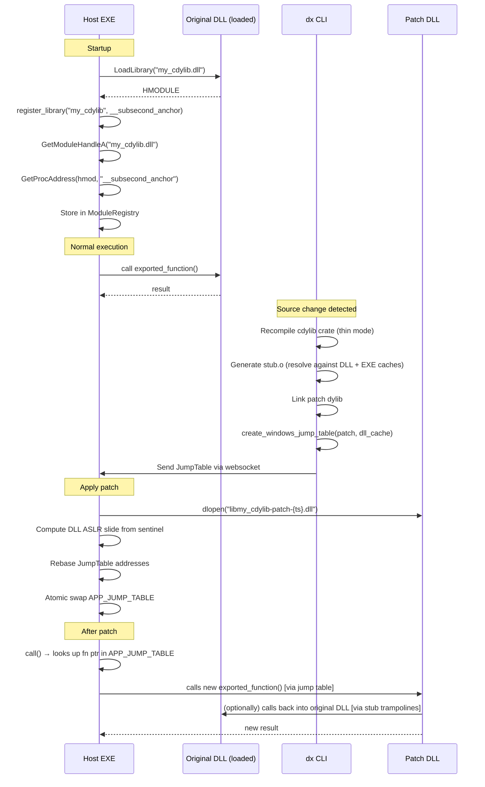

# Subsecond DLL Support: Implementation Plan

**Date:** August 4, 2026  
**Based on:** `subsecond_for_dlls.md` conclusions  
**Target repository:** <https://github.com/DioxusLabs/dioxus>, branch `main`  
**First milestone:** Windows `cdylib` with exported `extern "C"` functions only

---

## 1. Executive Summary

### Recommended Approach

**Approach 1: Generalize the tip crate** from `subsecond_for_dlls.md`. Allow a `cdylib` crate to be selected as the patch target. Reuse the existing Subsecond pipeline with localized changes: replace the `main` sentinel with a DLL-specific sentinel export, build the `HotpatchModuleCache` from the DLL instead of the EXE, and parameterize the runtime's module discovery.

### Proposed First Supported Configuration

| Property | Value |
|----------|-------|
| Platform | Windows (x86_64, MSVC toolchain) |
| Crate type | `cdylib` |
| Workspace | DLL in same Cargo workspace as host EXE |
| Patchable functions | `#[no_mangle] pub extern "C"` only |
| Patch mechanism | Existing patch-dylib generation + jump-table swapping |
| Original DLL | Stays loaded; never replaced |
| Internal Rust symbols | Not in first milestone |

### Estimated Total Effort (First Usable Version)

**8–12 person-days** for Windows exported-function support.  
**3–5 person-days** for a proof-of-concept prototype.

### Main Architectural Changes

1. **Sentinel abstraction:** Replace hardcoded `main` with a `PatchTargetModule` that carries module identity and a configurable sentinel symbol.
2. **Patch target generalization:** `PatchTargetKind` enum to distinguish executable from dynamic library targets.
3. **Per-module `HotpatchModuleCache`:** Build cache from the DLL artifact instead of the EXE artifact.
4. **Runtime module discovery:** `register_library()` API that accepts a Windows `HMODULE` and sentinel symbol name.
5. **Multi-cache stub resolution:** When building patches for a DLL, resolve undefined symbols against both the DLL's cache and the EXE's cache.

### Most Important Technical Risk

**PDB availability for the fat DLL build.** Subsecond's Windows symbol resolution relies entirely on `.pdb` files. If the fat DLL build does not produce a PDB with `Public` symbols (or if the PDB lacks the sentinel symbol), patching is impossible. This is mitigated because `cdylib` builds with the MSVC toolchain always generate PDBs, and exported `extern "C"` functions always appear as `Public` symbols.

### Reusable Existing Code

Approximately **80%** of the Subsecond codebase can be reused without modification:

- All runtime patching (`apply_patch`, `commit_patch`, `HotFn::try_call`, jump table swap).
- All build pipeline infrastructure (rustc replay, thin/fat linking, workspace crate compilation).
- All platform-specific stub generation (`create_undefined_symbol_stub` assembly trampolines).
- All PDB/ELF/Mach-O parsing (the `pdb`, `object`, and `walrus` crates work for DLLs too).
- The devtools websocket protocol and patch delivery mechanism.

---

## 2. Current Assumptions to Verify

Each assumption from `subsecond_for_dlls.md` is listed with its verification method and failure condition.

### Assumption 1: Runtime patch mechanism is module-agnostic

| Property | Detail |
|----------|--------|
| **Source** | `packages/subsecond/subsecond/src/lib.rs`, `apply_patch()` |
| **Relevant code** | `APP_JUMP_TABLE` is a process-global `AtomicPtr<JumpTable>`. `commit_patch()` does an atomic store. `HotFn::try_call()` looks up function pointers in this single global table. |
| **Verification** | Call a DLL function through `subsecond::call()`. Verify the lookup in `APP_JUMP_TABLE` succeeds regardless of which module the function lives in. |
| **Invalidation** | If the jump table lookup fails for DLL-resident function pointers (e.g., because DLL function pointers use a different representation), the approach is invalid. **Unlikely:** function pointers are flat addresses regardless of module. |

### Assumption 2: Patch code is already emitted as a separate dylib

| Property | Detail |
|----------|--------|
| **Source** | `packages/cli/src/build/link.rs`, `compile_workspace_hotpatch()` and `patch_exe()` |
| **Relevant code** | `patch_exe()` returns `lib{name}-patch-{timestamp}.{dll/so/dylib}`. The thin link step uses `-shared`/`-dylib`/`/DLL` flags. |
| **Verification** | Inspect the output of a thin build: confirm the patch is a valid PE DLL (Windows) or ELF shared object (Linux). |
| **Invalidation** | None — this is confirmed by source inspection. The patch IS a dylib. |

### Assumption 3: Jump-table swapping can redirect DLL functions

| Property | Detail |
|----------|--------|
| **Source** | `packages/subsecond/subsecond/src/lib.rs`, `apply_patch()` |
| **Relevant code** | `table.map = table.map.iter().map(|(k, v)| { ((*k as usize + old_offset) as u64, (*v as usize + new_offset) as u64) }).collect();` — the jump table is rebased with ASLR offsets and atomically swapped. |
| **Verification** | Manually construct a `JumpTable` with an old DLL function address → new patch function address. Call through `HotFn::try_call()`. |
| **Invalidation** | If DLL function addresses in the jump table are not rebased correctly (wrong ASLR slide), calls will jump to wrong addresses. **Likely failure mode** if the ASLR sentinel is wrong. |

### Assumption 4: The sentinel is the primary executable-specific anchor

| Property | Detail |
|----------|--------|
| **Source** | `packages/subsecond/subsecond/src/lib.rs`, `aslr_reference()` |
| **Relevant code** | `GetProcAddress(GetModuleHandleA(std::ptr::null()), c"main".as_ptr())` — always queries the EXE. |
| **Verification** | Call `GetProcAddress(GetModuleHandleA("my_cdylib.dll"), "my_sentinel")` and verify it returns a valid address within the DLL's address range. |
| **Invalidation** | If the sentinel symbol is not exported or is stripped, `GetProcAddress` returns NULL. **Mitigation:** the sentinel must be `#[no_mangle] pub extern "C"`. |

### Assumption 5: Symbol and debug-info parsers can operate on a DLL

| Property | Detail |
|----------|--------|
| **Source** | `packages/cli/src/build/patch.rs`, `HotpatchModuleCache::new()` |
| **Relevant code** | For Windows: `pdb::PDB::open(old_pdb_file_handle)` — opens `.pdb` file. For native: `object::File::parse(&old_bytes)` — parses ELF/Mach-O. |
| **Verification** | Build a `cdylib`, open its `.pdb` with the `pdb` crate, enumerate `Public` symbols. Confirm exported functions appear. |
| **Invalidation** | If the `.pdb` for a `cdylib` lacks `Public` symbols or uses a different internal structure from an EXE's PDB. **Unlikely** per Microsoft PDB specification. |

### Assumption 6: Build pipeline can be generalized from bin tip to library target

| Property | Detail |
|----------|--------|
| **Source** | `packages/cli/src/build/request.rs`, `tip_crate_name()`, `executable_type()` |
| **Relevant code** | `tip_crate_name()` = `self.main_target.replace('-', "_")`. `executable_type()` = `self.crate_target.kind[0].clone()` (always `TargetKind::Bin` currently). |
| **Verification** | Create a `BuildRequest` with a `cdylib` target. Trace through the build pipeline to identify every place that assumes `TargetKind::Bin`. |
| **Invalidation** | If the build pipeline has deep assumptions about producing an executable (not just the tip concept), the changes may be larger than estimated. **Partial risk:** the fat archive step and linker flag selection may need adjustment. |

---

## 3. Proposed Architecture

### 3.1 User-Facing Flow

1. User creates a Cargo workspace with a host `bin` crate and a `cdylib` crate.
2. The `cdylib` exports a sentinel function and the functions to be patched.
3. User adds `subsecond::register_library("my_cdylib", sentinel_fn)` in their host's startup code after loading the DLL.
4. User runs `dx serve --hotpatch --patch-target my_cdylib --lib`.
5. On source change, the CLI builds a patch dylib for the `cdylib` target.
6. The patch is delivered to the running host via websocket.
7. The host's Subsecond runtime applies the patch, redirecting DLL function calls through the new jump table.

### 3.2 Internal Architecture

```
┌──────────────────────────────────────────────────────────────────┐
│                         BUILD TIME                               │
│                                                                  │
│  ┌─────────────────┐     ┌──────────────────────────────────┐   │
│  │ BuildRequest    │     │ PatchTarget                      │   │
│  │                 │     │  - kind: DynamicLibrary           │   │
│  │ crate_target ───┼────▶│  - crate_name: "my_cdylib"       │   │
│  │ (cdylib Target) │     │  - sentinel: "__subsecond_anchor"│   │
│  └─────────────────┘     └──────────────┬───────────────────┘   │
│                                         │                       │
│  ┌──────────────────────────────────────▼───────────────────┐   │
│  │ Fat Build: cargo rustc --lib (cdylib target)             │   │
│  │   → outputs my_cdylib.dll + my_cdylib.pdb                │   │
│  │   → HotpatchModuleCache built from my_cdylib.pdb         │   │
│  │   → cache stores DLL symbols (sentinel + exports)        │   │
│  └──────────────────────────────────────────────────────────┘   │
│                                         │                       │
│  ┌──────────────────────────────────────▼───────────────────┐   │
│  │ Thin Build: replay workspace crates + relink             │   │
│  │   → extract cdylib .rcgu.o files                         │   │
│  │   → create_undefined_symbol_stub(cache, ...)              │   │
│  │     → resolves against DLL cache AND EXE cache           │   │
│  │   → link as libmy_cdylib-patch-{ts}.dll (/DLL flag)     │   │
│  │   → create_windows_jump_table(patch_dll, dll_cache)      │   │
│  │     → sentinel = "__subsecond_anchor" (not "main")       │   │
│  │   → JumpTable { lib, map, aslr_reference, new_base }     │   │
│  └──────────────────────────────────────────────────────────┘   │
└──────────────────────────────────────────────────────────────────┘
                              │ Websocket
                              ▼
┌──────────────────────────────────────────────────────────────────┐
│                        RUNTIME                                   │
│                                                                  │
│  ┌───────────────────────────────────────────────────────────┐  │
│  │ register_library("my_cdylib.dll", __subsecond_anchor)     │  │
│  │   → GetModuleHandleA("my_cdylib.dll") → HMODULE           │  │
│  │   → GetProcAddress(hmod, "__subsecond_anchor") → sentinel │  │
│  │   → store: ModuleRegistry[dll_name] = { hmod, sentinel }  │  │
│  └───────────────────────────────────────────────────────────┘  │
│                              │                                   │
│  ┌───────────────────────────▼───────────────────────────────┐  │
│  │ apply_patch_for_module(table, module_name)                │  │
│  │   → dlopen patch dylib                                    │  │
│  │   → lookup sentinel in ModuleRegistry[module_name]        │  │
│  │   → compute ASLR slide from DLL sentinel                  │  │
│  │   → rebase JumpTable                                      │  │
│  │   → commit_patch (atomic swap APP_JUMP_TABLE)             │  │
│  └───────────────────────────────────────────────────────────┘  │
└──────────────────────────────────────────────────────────────────┘
```

### 3.3 Sequence Diagram



---

## 4. Public API Design

### 4.1 Proposed API

**Recommended: `register_library` with sentinel function pointer.**

```rust
// Proposed code — new API for subsecond crate

use std::ffi::c_void;

/// Register a dynamically loaded library for hot-patching.
///
/// The sentinel function must be exported with `#[no_mangle] pub extern "C"`.
/// It serves as the ASLR reference point for this library, analogous to how
/// `main` serves as the reference for the host executable.
///
/// # Arguments
/// * `library_name` - The filesystem name of the library as passed to
///   `LoadLibrary`/`dlopen`, e.g. `"my_cdylib.dll"`. Used to locate the
///   module at runtime.
/// * `sentinel` - A pointer to an exported function in the library.
///   Typically this is a dedicated `__subsecond_anchor` function, but any
///   stable exported function works.
///
/// # Errors
/// Returns `Err` if the library cannot be found or the sentinel is not
/// within the library's address range.
///
/// # Safety
/// The sentinel pointer must point to a valid function in the named library.
/// The library must remain loaded for the lifetime of all patches.
pub unsafe fn register_library(
    library_name: &str,
    sentinel: *const c_void,
) -> Result<(), RegistrationError>;

/// Errors that can occur during library registration.
#[derive(Debug, thiserror::Error)]
pub enum RegistrationError {
    #[error("Library '{0}' is not loaded in the current process")]
    LibraryNotLoaded(String),

    #[error("Sentinel address {0:#x} does not belong to library '{1}'")]
    SentinelNotInLibrary(usize, String),

    #[error("Library '{0}' is already registered")]
    AlreadyRegistered(String),

    #[error("Failed to query library information: {0}")]
    QueryFailed(String),
}

/// Register a library by looking up its sentinel symbol by name.
///
/// Convenience wrapper around `register_library` that resolves the
/// sentinel via `GetProcAddress`/`dlsym`.
///
/// # Safety
/// Same safety requirements as `register_library`.
pub unsafe fn register_library_from_symbol(
    library_name: &str,
    sentinel_symbol_name: &str,
) -> Result<(), RegistrationError>;

/// Information about a registered patch target module.
#[derive(Clone, Debug)]
#[non_exhaustive]
pub struct RegisteredModule {
    /// The filesystem name of the library.
    pub name: String,
    /// The base address (HMODULE on Windows, link_map address on Linux).
    pub base_address: usize,
    /// The runtime address of the sentinel function.
    pub sentinel_address: usize,
    /// The size of the module image in bytes.
    pub image_size: usize,
}

/// Get information about all registered patch target modules.
pub fn registered_modules() -> Vec<RegisteredModule>;
```

### 4.2 Evaluation of Alternatives

| API | Pros | Cons | Verdict |
|-----|------|------|---------|
| `register_library(name, sentinel_fn_ptr)` | Explicit; caller controls sentinel; works with any loading mechanism | Requires the sentinel function to be callable at registration time | **Recommended** |
| `register_library_from_symbol(name, symbol_name)` | Convenient; no need to hold a function pointer | Requires the symbol to be resolvable via `GetProcAddress`/`dlsym`; may fail if symbol not exported | Good convenience wrapper |
| `register_loaded_module(module_handle)` | Works with raw OS handles; no sentinel needed | Requires a different ASLR computation approach (parse PE/ELF headers for base address); more complex | Future option |
| `hot_reload_library!(lib)` macro | Ergonomic; could auto-generate sentinel | Adds macro complexity; less flexible for unusual loading patterns | Future option |

### 4.3 Why `register_library` is the Best First Implementation

1. **Explicit:** The caller knows exactly which library and sentinel are being registered.
2. **Works with any loading mechanism:** `LoadLibrary`, `libloading::Library::new`, or even custom DLL loaders.
3. **Matches the existing `main` sentinel pattern:** Just as `main` is always available in the EXE, a dedicated `__subsecond_anchor` export is always available in the DLL.
4. **Sentinel stability:** A dedicated `#[no_mangle] pub extern "C" fn __subsecond_anchor() {}` function never changes signature or gets optimized away.
5. **Module identity:** The library name ties the runtime registration to the build-side cache, enabling patch-target matching.

### 4.4 API Usage Example

```rust
// Proposed code — host executable

// In the cdylib crate:
// #[no_mangle] pub extern "C" fn __subsecond_anchor() {}
// #[no_mangle] pub extern "C" fn game_update(dt: f32) { ... }

fn main() {
    // Load the DLL
    let lib = unsafe {
        libloading::Library::new("my_game_cdylib.dll")
            .expect("Failed to load game DLL")
    };

    // Register for hot-patching
    let sentinel: libloading::Symbol<extern "C" fn()> = unsafe {
        lib.get(b"__subsecond_anchor")
            .expect("Sentinel not exported")
    };
    unsafe {
        subsecond::register_library(
            "my_game_cdylib.dll",
            *sentinel as *const std::ffi::c_void,
        )
        .expect("Failed to register library for hot-patching");
    }

    // Call DLL functions through subsecond for hot-reload support
    loop {
        subsecond::call(|| {
            // This call goes through the jump table
            call_game_update(0.016);
        });
    }
}

// Trampoline that routes through the jump table
fn call_game_update(dt: f32) {
    // In the DLL: #[no_mangle] pub extern "C" fn game_update(dt: f32) { ... }
    extern "C" {
        fn game_update(dt: f32);
    }
    unsafe { game_update(dt); }
}
```

### 4.5 API Design Decisions

| Decision | Rationale |
|----------|----------|
| Registration is called from the host, not the DLL | The host controls the DLL lifecycle. The DLL may not know its own filename or loading context |
| `library_name` matches the DLL filename | Used for `GetModuleHandleA` lookup; must match what the OS loader uses |
| Multiple DLLs can be registered | Each gets its own entry in the `ModuleRegistry`; patches are per-module |
| Registration is NOT idempotent | Returns `AlreadyRegistered` error on second call; prevents accidental duplicate registrations |
| Sentinel is an `extern "C" fn()` | Stable ABI; cannot be optimized away; always resolvable via `GetProcAddress` |
| Module identity validated via sentinel address range | Use `VirtualQuery` (Windows) to confirm the sentinel address falls within the named DLL's image |

---

## 5. Configuration and Cargo Integration

### 5.1 Proposed CLI Syntax

```bash
# Patch a cdylib target in the workspace
dx serve --hotpatch --package my_cdylib --lib

# Shorthand
dx serve --hotpatch --patch-target my_cdylib
```

### 5.2 Proposed Cargo Metadata (Optional)

For projects that always want DLL patching, add to the cdylib's `Cargo.toml`:

```toml
# Proposed code — cdylib crate Cargo.toml
[package.metadata.subsecond]
# This crate is a patchable dynamic library
patch-target = true
# The sentinel symbol to use (default: "__subsecond_anchor")
sentinel = "__subsecond_anchor"
```

### 5.3 Target Selection Logic

```
1. If --patch-target <name> is passed:
   → Search workspace for a cdylib/dylib target named <name>
   → If found and TargetKind::Lib, use as patch target
   → If found but TargetKind::Bin, error: "use --bin for executables"
   → If not found, error

2. If --package <pkg> --lib is passed:
   → Find package <pkg> in workspace
   → If it has a lib target with crate-type cdylib or dylib:
     → Use as patch target
   → Error if multiple lib targets exist and none specified

3. If Cargo.toml has [package.metadata.subsecond] patch-target = true:
   → Auto-detect as patch target

4. Default: patch the bin target (existing behavior, backward compatible)
```

### 5.4 Handling Edge Cases

| Scenario | Behavior |
|----------|----------|
| Multiple `cdylib` targets in one package | Error: "Multiple library targets found. Specify with --lib <name>." |
| Workspace with bin + multiple cdylibs | Each cdylib must be patched with a separate `dx serve` invocation or patched sequentially |
| Renamed library target (`lib.name = "foo"`, `package.name = "bar"`) | Use the target name (after `--package bar --lib foo`) |
| Different target triples for EXE and DLL | Not supported in first milestone; both must share the same triple |
| Debug vs release | Works for both; debug has more symbols; release needs `debug = true` in profile |
| Feature flags | Propagated via the captured `RustcArgs`; consistent between fat and thin builds |
| Multiple registered DLLs at runtime | Each gets its own `ModuleRegistry` entry; patches are delivered with a `module_name` field |

---

## 6. Source-Level Change Map

The following table lists every source file expected to change, with concrete details. Paths are confirmed from the repository.

| File | Current Responsibility | Required Change | New Types/Functions | Risk | Est. Δ |
|------|----------------------|-----------------|-------------------|------|--------|
| `packages/subsecond/subsecond-types/src/lib.rs` | `JumpTable` struct definition | Add `module_name: Option<String>` field to `JumpTable` | None (field addition only) | Low — backward compatible | ~5 lines |
| `packages/subsecond/subsecond/src/lib.rs` | Runtime patching: `apply_patch()`, `aslr_reference()`, global state | Add `ModuleRegistry` static; add `register_library()`, `register_library_from_symbol()`, `apply_patch_for_module()`; modify `aslr_reference()` to accept optional module name; add `resolve_module_sentinel()` | `RegistrationError`, `RegisteredModule`, `ModuleRegistry` (HashMap), `register_library()`, `register_library_from_symbol()`, `resolve_module_sentinel()` | Medium — global state, platform FFI | ~150–250 lines |
| `packages/cli/src/build/request.rs` | `BuildRequest` struct, `tip_crate_name()`, `executable_type()` | Add `patch_target: Option<PatchTarget>` field; add `PatchTarget` struct; generalize `tip_crate_name()` to check `patch_target`; add `patch_target_name()` method; add `--patch-target` CLI flag parsing | `PatchTarget { kind: PatchTargetKind, crate_name: String, sentinel: String }`, `PatchTargetKind` enum, `patch_target_name()` | Medium — core build struct | ~50–100 lines |
| `packages/cli/src/build/link.rs` | Build orchestration: `compile_workspace_hotpatch()`, fat/thin link | Use `PatchTarget` to determine: (a) which crate's objects to extract, (b) which linker flags to use, (c) whether to pass `--lib` vs `--bin` to cargo, (d) which sentinel name to use in jump table creation; adjust `cargo_build_command()` to pass `--lib` for DLL targets; conditionally add `/EXPORT:sentinel` for MSVC linker | None (modifications to existing functions) | High — central build logic | ~80–150 lines |
| `packages/cli/src/build/patch.rs` | Symbol resolution: `HotpatchModuleCache`, jump table creation, stub generation | Add `module_cache: HashMap<String, HotpatchModuleCache>` to support multi-module caches; modify `create_undefined_symbol_stub()` to search multiple caches; modify `create_windows_jump_table()` and `create_native_jump_table()` to accept configurable sentinel name; add `create_dll_jump_table()` wrapper; add `sentinel_for_target()` helper | `sentinel_for_target()`, modified `create_undefined_symbol_stub()` signature | High — multi-cache resolution | ~100–200 lines |
| `packages/cli/src/build/builder.rs` | `AppBuilder`: build state, `patch_rebuild()`, `hotpatch()` | Track multiple `aslr_reference` values (one per registered module); handle multi-target patches in `patch_rebuild()`; deliver patch with `module_name` in `hotpatch()` | Modified `AppBuilder` fields | Medium — state management | ~50–80 lines |
| `packages/cli/src/serve/server.rs` | Devserver websocket | Forward `module_name` field in patch messages; expect `aslr_reference` per module from client | None (field forwarding) | Low | ~10–20 lines |

### 6.1 Detailed Change Specifications

#### `JumpTable` — New Field (Existing Code)

```rust
// Existing code — packages/subsecond/subsecond-types/src/lib.rs
#[derive(Serialize, Deserialize, Debug, Clone, PartialEq)]
pub struct JumpTable {
    pub lib: PathBuf,
    pub map: AddressMap,
    pub aslr_reference: u64,
    pub new_base_address: u64,
    pub ifunc_count: u64,
    // Proposed addition:
    /// If set, identifies which registered module this patch targets.
    /// None means the patch targets the main executable (backward compatible).
    #[serde(default)]
    pub module_name: Option<String>,
}
```

#### `PatchTarget` — New Type (Proposed Code)

```rust
// Proposed code — packages/cli/src/build/request.rs

/// Describes which crate to patch and how.
#[derive(Clone, Debug)]
pub(crate) struct PatchTarget {
    /// The crate name (underscore-normalized, as rustc uses it).
    pub crate_name: String,
    /// The package name (underscore-normalized, for workspace lookups).
    pub package_name: String,
    /// Whether this is an executable or a dynamic library.
    pub kind: PatchTargetKind,
    /// The name of the sentinel symbol exported from this target.
    /// Defaults to "main" for executables, "__subsecond_anchor" for dylibs.
    pub sentinel: String,
}

#[derive(Clone, Debug, PartialEq)]
pub(crate) enum PatchTargetKind {
    Executable,
    DynamicLibrary,
}

impl BuildRequest {
    // Proposed addition
    pub(crate) fn patch_target(&self) -> PatchTarget {
        if let Some(ref pt) = self.patch_target {
            return pt.clone();
        }
        // Default: executable using main sentinel (backward compatible)
        PatchTarget {
            crate_name: self.tip_crate_name(),
            package_name: self.tip_package_name(),
            kind: PatchTargetKind::Executable,
            sentinel: "main".to_string(),
        }
    }

    /// Returns the effective patch target crate name.
    /// Replaces the concept of "tip crate" with "patch target."
    pub(crate) fn patch_target_name(&self) -> String {
        self.patch_target().crate_name
    }
}
```

#### `register_library` — New Runtime Function (Proposed Code)

```rust
// Proposed code — packages/subsecond/subsecond/src/lib.rs

use std::collections::HashMap;
use std::sync::Mutex;

static MODULE_REGISTRY: Mutex<HashMap<String, RegisteredModule>> =
    Mutex::new(HashMap::new());

#[derive(Clone, Debug)]
#[non_exhaustive]
pub struct RegisteredModule {
    pub name: String,
    pub base_address: usize,
    pub sentinel_address: usize,
    pub image_size: usize,
}

pub unsafe fn register_library(
    library_name: &str,
    sentinel: *const std::ffi::c_void,
) -> Result<(), RegistrationError> {
    #[cfg(windows)]
    {
        use std::ffi::CString;
        let name_cstr = CString::new(library_name)
            .map_err(|_| RegistrationError::LibraryNotLoaded(library_name.to_string()))?;

        // Declare needed Windows APIs
        extern "system" {
            fn GetModuleHandleA(lpModuleName: *const i8) -> *mut std::ffi::c_void;
            fn GetModuleInformation(
                hProcess: *mut std::ffi::c_void,
                hModule: *mut std::ffi::c_void,
                lpmodinfo: *mut MODULEINFO,
                cb: u32,
            ) -> i32;
            fn GetCurrentProcess() -> *mut std::ffi::c_void;
        }

        #[repr(C)]
        struct MODULEINFO {
            lpBaseOfDll: *mut std::ffi::c_void,
            SizeOfImage: u32,
            EntryPoint: *mut std::ffi::c_void,
        }

        let hmod = GetModuleHandleA(name_cstr.as_ptr() as *const i8);
        if hmod.is_null() {
            return Err(RegistrationError::LibraryNotLoaded(library_name.to_string()));
        }

        let mut modinfo: MODULEINFO = unsafe { std::mem::zeroed() };
        let ok = unsafe {
            GetModuleInformation(
                GetCurrentProcess(),
                hmod,
                &mut modinfo,
                std::mem::size_of::<MODULEINFO>() as u32,
            )
        };
        if ok == 0 {
            return Err(RegistrationError::QueryFailed(library_name.to_string()));
        }

        let base = modinfo.lpBaseOfDll as usize;
        let size = modinfo.SizeOfImage as usize;
        let sentinel_addr = sentinel as usize;

        // Verify the sentinel is within the DLL's address range
        if sentinel_addr < base || sentinel_addr >= base + size {
            return Err(RegistrationError::SentinelNotInLibrary(
                sentinel_addr,
                library_name.to_string(),
            ));
        }

        let mut registry = MODULE_REGISTRY.lock().unwrap();
        if registry.contains_key(library_name) {
            return Err(RegistrationError::AlreadyRegistered(library_name.to_string()));
        }

        registry.insert(
            library_name.to_string(),
            RegisteredModule {
                name: library_name.to_string(),
                base_address: base,
                sentinel_address: sentinel_addr,
                image_size: size,
            },
        );

        Ok(())
    }

    #[cfg(not(windows))]
    {
        // Placeholder for Linux/macOS implementation
        Err(RegistrationError::QueryFailed(
            "register_library is currently only supported on Windows".to_string(),
        ))
    }
}
```

#### Sentinel Resolution in `apply_patch` (Modification to Existing Code)

```rust
// Existing code location: packages/subsecond/subsecond/src/lib.rs, apply_patch()
// Current code:
//   let old_offset = aslr_reference() - table.aslr_reference as usize;

// Proposed modification:
let old_offset = if let Some(ref module_name) = table.module_name {
    // Use the DLL-specific sentinel
    resolve_module_sentinel(module_name)? - table.aslr_reference as usize
} else {
    // Backward compatible: use main executable sentinel
    aslr_reference() - table.aslr_reference as usize
};

// Proposed new helper function:
fn resolve_module_sentinel(module_name: &str) -> Result<usize, PatchError> {
    let registry = MODULE_REGISTRY.lock().unwrap();
    let module = registry.get(module_name)
        .ok_or_else(|| PatchError::Dlopen(format!(
            "Module '{}' is not registered. Call register_library() first.",
            module_name
        )))?;
    Ok(module.sentinel_address)
}
```

---

## 7. Replace the Executable Sentinel Abstraction

### 7.1 Current Sentinel Mechanism

**Source:** `packages/subsecond/subsecond/src/lib.rs`, function `aslr_reference()`

The current sentinel is `main`:
- **Windows:** `GetProcAddress(GetModuleHandleA(NULL), "main")` — queries the EXE's export table.
- **Unix:** `dlsym(RTLD_DEFAULT, "main")` — searches the global symbol namespace.
- **Self-initializing:** Uses a `static mut MAIN_PTR` that is cached after the first lookup.

The `main` symbol is guaranteed to exist in the EXE because:
1. The MSVC CRT exports `main` for startup.
2. The fat build passes `/EXPORT:main` to the linker (see `link.rs` `run_fat_link()`: `args.push("/EXPORT:main".to_string())`).
3. On Linux/macOS, `--export-dynamic-symbol,main` / `-exported_symbol,_main` ensures visibility.

### 7.2 DLL Sentinel Design

For a DLL, we cannot use `main`. Instead:

1. **The DLL exports a dedicated sentinel function:**
   ```rust
   // In the cdylib crate
   #[no_mangle]
   pub extern "C" fn __subsecond_anchor() {}
   ```
   The function body is empty — it only exists to provide a stable address.

2. **The fat build exports the sentinel:**
   The existing fat link code in `run_fat_link()` already adds `/EXPORT:main` for executables. For DLL targets, we add `/EXPORT:__subsecond_anchor`.

3. **The jump table uses the sentinel's link-time address:**
   In `create_windows_jump_table()`, replace `"main"` with the configurable sentinel name:
   ```rust
   // Proposed modification to create_windows_jump_table()
   let sentinel = sentinel_for_target(target); // "__subsecond_anchor" for DLLs
   let new_base_address = new_name_to_addr
       .get(sentinel)
       .cloned()
       .context("failed to find sentinel symbol in patch")?;
   let aslr_reference = old_name_to_addr
       .get(sentinel)
       .map(|s| s.address)
       .context("failed to find sentinel symbol in original module")?;
   ```

4. **The runtime resolves the sentinel at the DLL's load address:**
   ```rust
   // Proposed code
   // In apply_patch(), for a DLL patch:
   // The sentinel address was stored during register_library().
   // ASLR slide = runtime_sentinel_address - table.aslr_reference
   ```

### 7.3 ASLR Adjustment Flow (Pseudocode)

```
┌── Build Time ──────────────────────────────────────────────┐
│                                                             │
│  Fat DLL built. PDB contains:                               │
│    __subsecond_anchor → RVA 0x00001200                      │
│    exported_function  → RVA 0x00002340                      │
│                                                             │
│  Patch DLL built. PDB contains:                             │
│    __subsecond_anchor → RVA 0x00001000                      │
│    exported_function  → RVA 0x00002000  (new impl)          │
│                                                             │
│  JumpTable:                                                 │
│    aslr_reference = 0x00001200  (fat DLL link-time address  │
│                     of __subsecond_anchor)                  │
│    new_base_address = 0x00001000 (patch DLL link-time addr  │
│                       of __subsecond_anchor)                │
│    map = { 0x00002340: 0x00002000 }  (old→new fn addresses) │
│                                                             │
└─────────────────────────────────────────────────────────────┘

┌── Runtime ─────────────────────────────────────────────────┐
│                                                             │
│  DLL loaded at base address 0x7FF8_A000_0000 (ASLR'd)      │
│  register_library() stored:                                │
│    sentinel_address = 0x7FF8_A000_1200                      │
│                                                             │
│  apply_patch():                                            │
│    old_slide = 0x7FF8_A000_1200 - 0x00001200               │
│              = 0x7FF8_A000_0000                             │
│                                                             │
│    patch DLL loaded at, e.g., 0x7FF8_B000_0000             │
│    new_slide = GetProcAddress(patch_hmod, "__subsecond_anchor") │
│              - 0x00001000                                   │
│              = 0x7FF8_B000_0000                             │
│                                                             │
│    Rebased map:                                            │
│      old: 0x00002340 + 0x7FF8_A000_0000 = 0x7FF8_A000_2340 │
│      new: 0x00002000 + 0x7FF8_B000_0000 = 0x7FF8_B000_2000 │
│                                                             │
│    → Calls to original fn (at 0x7FF8_A000_2340) now go    │
│      to patch fn (at 0x7FF8_B000_2000)                     │
│                                                             │
└─────────────────────────────────────────────────────────────┘
```

### 7.4 Sentinel Design Decisions

| Decision | Rationale |
|----------|----------|
| Dedicated `__subsecond_anchor` function | Avoids depending on any particular application function that might change |
| Empty function body | Minimal code size; never inlined; always has a stable address |
| `#[no_mangle] pub extern "C"` | Guaranteed export; stable ABI; no mangling |
| Stored in `ModuleRegistry` | Survives across multiple patches; only registered once |
| Sentry address range check | Prevents registering a sentinel from the wrong module |
| Symbol name prefix `__subsecond_` | Namespaced to avoid collisions with user exports |

---

## 8. Generalize the Tip-Crate Model

### 8.1 Current Model

The `BuildRequest` struct in `packages/cli/src/build/request.rs` has:
- `crate_target: krates::cm::Target` — always a `Bin` target (selected in `BuildRequest::new()`).
- `executable_type()` returns `TargetKind::Bin`.
- `tip_crate_name()` returns the hyphen-to-underscore name of `main_target`.

### 8.2 Proposed Generalization

Replace the implicit "tip = bin" assumption with an explicit `PatchTarget`:

```rust
// Proposed code — addition to BuildRequest

pub(crate) struct PatchTarget {
    pub crate_name: String,      // rustc --crate-name value
    pub package_name: String,    // Cargo package name (underscore-normalized)
    pub kind: PatchTargetKind,
    pub sentinel: String,        // "main" for EXE, "__subsecond_anchor" for DLL
}

pub(crate) enum PatchTargetKind {
    Executable,
    DynamicLibrary,
}
```

**Changes required:**

| Area | Current | Proposed |
|------|---------|----------|
| Target discovery | `TargetKind::Bin` hardcoded | Accept `TargetKind::Lib` for DLL targets |
| Cargo invocation | `--bin <name>` | `--lib` for DLL targets |
| Artifact selection | `format!("{}.bin", name)` as rustc key | `format!("{}.lib", name)` for DLL targets |
| Dependency graph traversal | `workspace_dependents_of(tip_package)` | `workspace_dependents_of(patch_target.package)` |
| Incremental compilation reuse | `workspace_hotpatch_replay_order` excludes tip | Excludes patch target (same logic, different name) |
| Patch crate generation | Extracts `.rcgu.o` from bin linker args | Extracts `.rcgu.o` from dylib linker args |
| Link arguments | Executable link flags | `-shared`/`-dylib`/`/DLL` already supported |
| Symbol ownership | All symbols in `WorkspaceRustcArgs` from tip | Same structure, different key (`.lib` vs `.bin`) |
| Cache layout | `HotpatchModuleCache` from fat EXE | `HotpatchModuleCache` from fat DLL |
| Error reporting | "Failed to find bin target" | "Failed to find lib target `{name}` of kind `cdylib`" |

### 8.3 Terminology Decision

**Keep "tip crate" as a concept but add "patch target."**

The term "tip crate" is deeply embedded in the codebase. Rather than renaming everything, we:
1. Add `PatchTarget` as a new explicit concept.
2. Make `tip_crate_name()` delegate to `patch_target().crate_name`.
3. Document that "tip crate" now means "the crate selected as the patch target, which may be a bin or a cdylib/dylib."

This minimizes diff size while achieving the generalization.

---

## 9. Symbol-Resolution Implementation

### 9.1 Scope for First Milestone

**Supported:** `Public` symbols in the DLL's `.pdb` file that correspond to `#[no_mangle] pub extern "C"` functions.

**Not supported:** Private Rust symbols, mangled names, `Procedure`/`Module` PDB records.

**Errors returned for:** Missing PDB, symbol not found, stripped binary.

### 9.2 Resolution Flow (Pseudocode)

```
function resolve_original_function(target_module, symbol_name) -> Result<usize>:
    // 1. Determine which cache to search
    cache = if target_module.kind == Executable:
        EXE_CACHE  // built from fat EXE's PDB
    else:
        DLL_CACHES[target_module.name]  // built from fat DLL's PDB

    // 2. Look up in the cache's symbol table
    if symbol_name not in cache.symbol_table:
        return Err(SymbolNotFound {
            symbol: symbol_name,
            module: target_module.name,
            hint: "Ensure the function is exported with \
                   #[no_mangle] pub extern \"C\" and that \
                   debug info is enabled (debug = true)."
        })

    cached_symbol = cache.symbol_table[symbol_name]

    // 3. Check symbol is not optimized away
    if cached_symbol.is_undefined:
        return Err(SymbolOptimizedAway {
            symbol: symbol_name,
            hint: "The symbol exists in debug info but has no address. \
                   It may have been optimized out by LTO or dead-code \
                   elimination. Disable LTO and ensure link-dead-code \
                   is enabled for the fat build."
        })

    // 4. Compute runtime address: RVA + module_base
    module_base = get_module_base(target_module.name)
    runtime_address = module_base + cached_symbol.address

    return Ok(runtime_address)
```

### 9.3 PDB Lookup Details (Windows)

The existing `HotpatchModuleCache::new()` for Windows already does what we need:

```rust
// Existing code — packages/cli/src/build/patch.rs, HotpatchModuleCache::new()
// Windows branch:
let old_pdb_file = original.with_extension("pdb");
let mut pdb_file = pdb::PDB::open(old_pdb_file_handle)?;
let global_symbols = pdb_file.global_symbols()?;
let address_map = pdb_file.address_map()?;

while let Ok(Some(symbol)) = symbols.next() {
    match symbol.parse() {
        Ok(pdb::SymbolData::Public(data)) => {
            let rva = data.offset.to_rva(&address_map);
            symbol_table.insert(
                data.name.to_string().to_string(),
                CachedSymbol {
                    address: rva.unwrap_or_default().0 as u64,
                    kind: if data.function { SymbolKind::Text } else { SymbolKind::Data },
                    // ...
                },
            );
        }
        // ...
    }
}
```

**For DLL support:** The only change is that `original` (the `&Path` parameter) is now the fat DLL binary (e.g., `my_cdylib.dll`) instead of the fat EXE. The `.pdb` file is found at `my_cdylib.pdb`. The parsing logic is identical.

### 9.4 Name Normalization

| Source | Name format | Example |
|--------|------------|---------|
| Rust `extern "C"` export | Exact C identifier | `game_update` |
| PDB `Public` symbol | Exact name as in object file | `game_update` |
| PE export table | Exact name | `game_update` |
| MSVC decorated (stdcall) | `_name@bytes` | `_game_update@4` — not applicable for `extern "C"` |

For `extern "C"` functions on x86_64 Windows, no decoration is applied. Names match exactly.

### 9.5 Unsupported Cases and Errors

| Case | Detection | Error Message |
|------|-----------|---------------|
| Missing PDB | `File::open(old_pdb_file)` fails | `"No debug symbols found for DLL '{name}'. Ensure your profile sets debug = true and the PDB file is present."` |
| Symbol not in PDB | Not found in `symbol_table` | `"Symbol '{name}' not found in DLL '{dll}'. Only exported extern \"C\" functions are supported in this version."` |
| Stripped binary | Empty `symbol_table` | `"DLL '{name}' has no public symbols. The binary may be stripped. Set strip = 'none' in your Cargo profile."` |
| Optimized away export | `rva.is_none()` | `"Symbol '{name}' exists in debug info but has no address. It may have been optimized away."` |
| Duplicate names | Multiple PDB entries with same name | Use the first one (linker guarantees uniqueness for public symbols) |
| COMDAT folding | Multiple symbols map to same RVA | Already handled: the jump table just maps the same old address to the same new address |
| Forwarded exports | Export points to another DLL | Not supported in first milestone; would need IAT/import resolution |

---

## 10. Patch-Linking Changes

### 10.1 What the Patch DLL Must Reference

A patched function in the DLL's replacement code may need to call:

| Target | Example | Resolution |
|--------|---------|------------|
| **Original DLL functions** | `game_update` calls `internal_helper()` in the original DLL | Stub trampoline — already supported by `create_undefined_symbol_stub()` |
| **Host EXE functions** | DLL patch calls `host_log()` in the EXE | Stub trampoline — needs EXE cache in addition to DLL cache |
| **Other DLLs** | DLL patch calls `sqlite3_exec()` | Stub trampoline — needs cache for that DLL |
| **Rust stdlib** | `alloc::vec::Vec::push` | Already in process — resolved by the dynamic linker when loading the patch dylib |
| **Static data in original DLL** | `static COUNTER: AtomicU32` | `__imp_COUNTER` — already handled by the `__imp_` data stub code in `create_undefined_symbol_stub()` |

### 10.2 Current Thin-Linking Compatibility

The existing thin-linking path (`compile_workspace_hotpatch()`) already:

1. **Produces a shared library:** `thin_link_args()` adds `/DLL` for MSVC, `-shared` for GNU, `-Wl,-dylib` for Darwin.
2. **Links against stub object:** `create_undefined_symbol_stub()` is called with the patch objects; it generates `stub.o` with trampolines.
3. **Resolves undefined symbols:** The stub generator creates text/data/TLS symbols that jump to the original binary's addresses.

**These mechanisms work unchanged for DLL patches.** The critical modification is:

### 10.3 Required Modifications

#### A. Multi-Cache Stub Resolution

**Current code** in `create_undefined_symbol_stub()`:
```rust
// Existing code — resolves all symbols against ONE cache
let aslr_ref_address = cache
    .symbol_table
    .get(main_sentinel(triple))
    .context("failed to find '_main' symbol in patch")?
    .address;
let aslr_offset = aslr_reference - aslr_ref_address;

for name in undefined_symbols {
    let Some(sym) = cache.symbol_table.get(name.as_str()) else {
        tracing::debug!("Symbol not found: {}", name);
        continue;
    };
    let abs_addr = sym.address + aslr_offset;
    // ... generate trampoline ...
}
```

**Proposed modification:**
```rust
// Proposed code — multi-cache search
fn resolve_symbol_in_caches(
    name: &str,
    caches: &[(&HotpatchModuleCache, u64)], // (cache, aslr_slide_for_that_cache)
) -> Option<(u64, SymbolKind)> {
    for (cache, slide) in caches {
        if let Some(sym) = cache.symbol_table.get(name) {
            if !sym.is_undefined {
                return Some((sym.address + slide, sym.kind));
            }
        }
    }
    None
}

// In create_undefined_symbol_stub():
// Build list of caches: [(dll_cache, dll_slide), (exe_cache, exe_slide)]
// For each undefined symbol, search all caches
```

#### B. Sentinel Parameterization

**Current code** uses `main_sentinel(triple)`:
```rust
// Existing code
let aslr_ref_address = cache
    .symbol_table
    .get(main_sentinel(triple))
    ...
```

**Proposed modification:** Accept a `sentinel_name: &str` parameter:
```rust
// Proposed code
pub fn create_undefined_symbol_stub(
    caches: &[(&HotpatchModuleCache, u64)],  // multiple (cache, aslr_slide)
    incrementals: &[PathBuf],
    triple: &Triple,
    primary_sentinel: &str,                   // was: aslr_reference
) -> Result<Vec<u8>> {
    // For each cache, compute its ASLR offset using its own sentinel
    for (cache, aslr_reference) in caches {
        let sentinel_addr = cache.symbol_table
            .get(primary_sentinel)
            .context("sentinel not found in cache")?
            .address;
        let aslr_offset = aslr_reference - sentinel_addr;
        // ... use this offset for symbols resolved from this cache ...
    }
}
```

#### C. MSVC `/EXPORT:sentinel` for DLL Fat Builds

In `run_fat_link()`, add the sentinel export:
```rust
// Proposed addition — near existing /EXPORT:main code
if target_kind == PatchTargetKind::DynamicLibrary {
    args.push(format!("/EXPORT:{}", sentinel_name));
}
```

### 10.4 Linker Flag Differences (EXE vs DLL)

| Platform | EXE Flags | DLL Flags (already used for patch) |
|----------|-----------|-----------------------------------|
| MSVC | `/SUBSYSTEM:WINDOWS` | `/DLL` (already in `thin_link_args()`) |
| GNU/Linux | default | `-shared` (already in `thin_link_args()`) |
| Darwin | default | `-Wl,-dylib` (already in `thin_link_args()`) |

**No new linker flags are needed.** The existing thin-link flags already produce DLLs/so/dylibs.

---

## 11. Runtime Registration and Module Discovery

### 11.1 Windows Implementation

#### Step 1: Locate the Loaded DLL

```rust
// Proposed code
// Use GetModuleHandleA to get the HMODULE (which IS the base address on Windows)
let name_cstr = CString::new("my_cdylib.dll")?;
let hmod = GetModuleHandleA(name_cstr.as_ptr() as *const i8);
if hmod.is_null() {
    return Err(RegistrationError::LibraryNotLoaded(name));
}
```

**Why `GetModuleHandleA`:** It returns the HMODULE (base address) of an already-loaded DLL without incrementing reference counts. It does not load the DLL if not already loaded — which is exactly what we want for a previously `LoadLibrary`'d DLL.

**Why not `GetModuleHandleExW`:** Not needed. `GetModuleHandleExW` adds flags for incrementing reference count or pinning. We don't want either for a library managed by the host application.

#### Step 2: Get Module Information

```rust
// Proposed code
let mut modinfo: MODULEINFO = unsafe { std::mem::zeroed() };
let ok = GetModuleInformation(
    GetCurrentProcess(),
    hmod,
    &mut modinfo,
    size_of::<MODULEINFO>() as u32,
);
```

**Why `GetModuleInformation`:** Provides `lpBaseOfDll` (base address) and `SizeOfImage` (total size). We use `SizeOfImage` to validate that the sentinel address falls within the module's bounds.

**Why not `VirtualQuery`:** `VirtualQuery` works on individual pages, not modules. `GetModuleInformation` is the canonical way to get module bounds.

#### Step 3: Resolve Sentinel Address

```rust
// Proposed code
// The sentinel is provided directly as a function pointer by the caller,
// so no GetProcAddress lookup is needed.
// But if using register_library_from_symbol():
let sentinel_ptr = GetProcAddress(hmod, c"__subsecond_anchor".as_ptr() as *const i8);
if sentinel_ptr.is_null() {
    return Err(RegistrationError::QueryFailed(
        "Sentinel symbol '__subsecond_anchor' not found in DLL".to_string()
    ));
}
let sentinel_addr = sentinel_ptr as usize;
```

#### Step 4: Validate Sentinel Belongs to Module

```rust
// Proposed code
let base = modinfo.lpBaseOfDll as usize;
let size = modinfo.SizeOfImage as usize;
if sentinel_addr < base || sentinel_addr >= base + size {
    return Err(RegistrationError::SentinelNotInLibrary(sentinel_addr, name));
}
```

### 11.2 Module Registration Lifecycle

```
1. Host loads DLL (LoadLibrary / libloading::Library::new)
   → DLL is mapped into process address space
   → HMODULE/base_address is now valid

2. Host calls register_library("my_cdylib.dll", sentinel_fn_ptr)
   → GetModuleHandleA confirms DLL is loaded
   → GetModuleInformation gets base + size
   → Sentinel address validated against module bounds
   → Entry added to MODULE_REGISTRY

3. Patches are applied via apply_patch()
   → JumpTable.module_name matches registry entry
   → DLL ASLR slide computed from stored sentinel_address
   → JumpTable rebased and committed

4. (Optional) Host unloads DLL (FreeLibrary / drop(lib))
   → If patches are still active for this module, function pointers dangle
   → Mitigation: unregister_library() clears registry entry;
     subsequent patches for this module will fail cleanly
```

### 11.3 Ownership and Reference Counting

- **`GetModuleHandleA` does NOT increment the reference count.** The host application is responsible for keeping the DLL loaded.
- **No `FreeLibrary` is called by Subsecond.** The host owns the DLL lifetime.
- **If the DLL is unloaded while patches are active:** The patch dylib's stub trampolines still point into the unloaded DLL's address space → access violation on next call. This is documented as a usage error.

### 11.4 Stale Registration Detection

If a DLL is unloaded and reloaded at a different base address (ASLR), the old `RegisteredModule` entry becomes stale. Detection:

```rust
// Proposed code
fn validate_registration(name: &str) -> Result<(), PatchError> {
    let registry = MODULE_REGISTRY.lock().unwrap();
    let registered = registry.get(name)
        .ok_or_else(|| PatchError::Dlopen(format!("Module '{}' is not registered", name)))?;

    let hmod = unsafe { GetModuleHandleA(/* name */) };
    if hmod.is_null() {
        return Err(PatchError::Dlopen(format!(
            "Module '{}' was unloaded after registration", name
        )));
    }

    let current_base = hmod as usize;
    if current_base != registered.base_address {
        return Err(PatchError::Dlopen(format!(
            "Module '{}' was reloaded at a different base address. \
             Re-register the library before applying patches.",
            name
        )));
    }

    Ok(())
}
```

---

## 12. Cache and Identity Changes

### 12.1 From Single Cache to Multi-Cache

**Current state:** The `BuildArtifacts` struct holds a single `patch_cache: Option<Arc<HotpatchModuleCache>>`. All stub resolution uses this one cache.

**Proposed state:**

```rust
// Proposed code — new types in packages/cli/src/build/patch.rs

/// A collection of module caches, keyed by module identity.
#[derive(Default)]
pub struct HotpatchCacheRegistry {
    /// The cache for the main executable (always present).
    pub exe_cache: Option<Arc<HotpatchModuleCache>>,
    /// Caches for additional registered modules (DLLs).
    pub module_caches: HashMap<ModuleCacheKey, Arc<HotpatchModuleCache>>,
}

/// A stable key identifying a specific build of a specific module.
#[derive(Clone, Debug, Hash, PartialEq, Eq)]
pub struct ModuleCacheKey {
    /// The Cargo package name (underscore-normalized).
    pub package_name: String,
    /// The crate name as rustc sees it.
    pub crate_name: String,
    /// Target kind: "cdylib", "dylib", "bin".
    pub crate_type: String,
    /// Target triple.
    pub triple: String,
    /// Build profile name.
    pub profile: String,
    /// Sorted, deduplicated feature set, joined by commas.
    pub features: String,
    /// SHA-256 hash of the fat binary's first 64KB + file size.
    /// Provides a content-based identity to detect mismatches.
    pub artifact_hash: String,
    /// PDB GUID + Age (Windows) or Build ID (ELF) or UUID (Mach-O).
    /// Provides an identity that survives rebuilds with identical content.
    pub debug_id: Option<String>,
}
```

### 12.2 Cache Key Construction

```rust
// Proposed code
fn compute_module_cache_key(
    target: &PatchTarget,
    request: &BuildRequest,
    fat_artifact: &Path,
) -> Result<ModuleCacheKey> {
    // Content hash for mismatch detection
    let mut file = std::fs::File::open(fat_artifact)?;
    let mut buffer = [0u8; 65536];
    let bytes_read = file.read(&mut buffer)?;
    let file_size = file.metadata()?.len();
    let mut hasher = Sha256::new();
    hasher.update(&buffer[..bytes_read]);
    hasher.update(&file_size.to_le_bytes());
    let artifact_hash = format!("{:x}", hasher.finalize());

    Ok(ModuleCacheKey {
        package_name: target.package_name.clone(),
        crate_name: target.crate_name.clone(),
        crate_type: format!("{:?}", target.kind).to_lowercase(),
        triple: request.triple.to_string(),
        profile: request.profile.clone(),
        features: {
            let mut feats = request.features.clone();
            feats.sort();
            feats.dedup();
            feats.join(",")
        },
        artifact_hash,
        debug_id: extract_debug_id(fat_artifact, &request.triple).ok(),
    })
}
```

### 12.3 Mismatch Detection

Before applying a patch, the runtime verifies:

1. **Module is registered:** `MODULE_REGISTRY` contains an entry with the `module_name` from the `JumpTable`.
2. **Base address matches:** `GetModuleHandleA` returns the same base address as at registration time.
3. **Sentinel address matches:** The sentinel at runtime is within tolerance of the registered value.

At build time, the CLI verifies:

1. **Cache exists:** A `HotpatchModuleCache` has been built from a fat build of the target.
2. **Cache key matches:** The cache key for the current build matches the key from the fat build (same crate, triple, profile, features).
3. **Artifact hash matches:** The fat DLL on disk matches the artifact hash in the cache key (hasn't been replaced by a different build).

---

## 13. Error Model and Diagnostics

### 13.1 Build-Time Errors

| Error | Detection | User-Facing Message |
|-------|-----------|-------------------|
| Target not a cdylib/dylib | `crate_target.kind` is not `Lib` or crate-type is not `cdylib`/`dylib` | `"Crate '{crate}' is not a dynamic library. Expected crate-type = ['cdylib'] or ['dylib'] in Cargo.toml."` |
| Multiple matching targets | Workspace has multiple cdylib targets | `"Multiple dynamic library targets found: {list}. Specify the target with --lib <name>."` |
| DLL not in workspace | `workspace_dependents_of()` cannot find the target | `"Crate '{crate}' is not a workspace member. Only workspace crates can be patch targets."` |
| Missing PDB | `File::open(pdb_path)` fails | `"No debug symbols (.pdb) found for '{dll}'. Set [profile.{profile}] debug = true and rebuild."` |
| Sentinel not exported | Sentinel symbol not found in PDB or export table | `"Sentinel symbol '{sentinel}' not found in '{dll}'. Add #[no_mangle] pub extern \"C\" fn {sentinel}() {{}} to your cdylib crate."` |
| LTO enabled | `lto = true` in profile | `"LTO is incompatible with hot-patching. Set lto = false in your profile or use a different profile for development."` |
| No symbols in PDB | `symbol_table.is_empty()` | `"The PDB for '{dll}' contains no public symbols. The DLL may be stripped. Set strip = 'none' in your profile."` |
| Symbol optimized away | Symbol exists in PDB but `rva.is_none()` | `"Function '{fn}' was optimized away. Ensure it is called from somewhere or mark it with #[used]."` |
| Patch target mismatch | Cache key from fat build doesn't match current build | `"The patch was built for a different version of '{dll}'. Rebuild the fat binary with 'dx serve --hotpatch'."` |

### 13.2 Runtime Errors

| Error | Detection | User-Facing Message |
|-------|-----------|-------------------|
| DLL not loaded | `GetModuleHandleA` returns NULL | `"Library '{name}' is not loaded. Call LoadLibrary or libloading::Library::new first."` |
| DLL loaded twice | Same DLL base address appears twice in registry (different names) | `"Library '{name}' is already registered. Each DLL can only be registered once."` |
| Wrong DLL version | `artifact_hash` in JumpTable doesn't match registered module's hash | `"Patch was built for a different version of '{name}'. The loaded DLL must match the fat build used to create this patch."` |
| Sentinel missing | `GetProcAddress` returns NULL for sentinel name | `"Sentinel '{sentinel}' not exported from '{name}'. Ensure the DLL exports this symbol."` |
| DLL unloaded | `GetModuleHandleA` returns NULL after registration | `"Library '{name}' was unloaded after registration. Re-load and re-register the library."` |
| DLL reloaded at different base | `GetModuleHandleA` returns non-NULL but different base address | `"Library '{name}' was reloaded at a different address. Re-register the library. Old patches are invalidated."` |
| Symbol not found in patch | `dlopen` succeeds but symbol lookup in patch fails | `"The patch dylib is missing expected symbols. This may indicate a build inconsistency."` |
| Unsupported LTO | Patch build attempted with LTO'd fat binary | `"The fat build used LTO, which merges functions and prevents individual patching. Rebuild without LTO."` |

### 13.3 Example Error Messages with Remediation

```
Error: Library 'my_game_cdylib.dll' is not loaded.

The patch target DLL must be loaded before patches can be applied.
Load it with:
  let lib = unsafe { libloading::Library::new("my_game_cdylib.dll")? };
Then register it with:
  unsafe { subsecond::register_library("my_game_cdylib.dll", sentinel_ptr)?; }
```

```
Error: Sentinel '__subsecond_anchor' not exported from 'my_game_cdylib.dll'.

Add the following to your cdylib crate's lib.rs:
  #[no_mangle]
  pub extern "C" fn __subsecond_anchor() {}

This function serves as an address reference point for ASLR calculations.
It does not need to do anything; an empty body is sufficient.
```

```
Error: No debug symbols (.pdb) found for 'my_game_cdylib.dll'.

Set debug = true in your Cargo profile:
  [profile.dev]
  debug = true

Then rebuild the fat binary with:
  dx serve --hotpatch --patch-target my_game_cdylib --lib
```

---

## 14. Testing Strategy

### 14.1 Test Matrix

| Test Case | Type | Platform | Profile | Expected Result |
|-----------|------|----------|---------|-----------------|
| Patch exported function (simple math) | E2E | Windows | debug | New result observed |
| Patch exported function (release) | E2E | Windows | release, debug=true | New result observed |
| Multiple patches to same function | E2E | Windows | debug | Each patch takes effect |
| Several functions in one patch | E2E | Windows | debug | All functions updated |
| Host calls DLL via `subsecond::call()` | Integration | Windows | debug | Call goes through jump table |
| DLL callback into host | Integration | Windows | debug | Stub trampoline works |
| DLL-to-DLL internal call | Integration | Windows | debug | Both functions in same patch |
| Static data read from patched function | Integration | Windows | debug | Static value preserved |
| Function pointer captured before patch | Unit | Windows | debug | Old pointer still works |
| Two DLLs registered | Integration | Windows | debug | Patches target correct DLL |
| DLL loaded from non-default directory | E2E | Windows | debug | `GetModuleHandleA` finds it |
| Mismatched DLL and PDB | Unit | Windows | debug | Clear error message |
| Rebuilt DLL without host restart | E2E | Windows | debug | New `register_library` works |
| Private Rust function (unsupported) | Unit | Windows | debug | Clear error: not exported |
| LTO enabled (unsupported) | Unit | Windows | release | Clear error on build |
| Optimized-away export | Unit | Windows | release+opt | Clear error: optimized away |
| Concurrent calls during patch | Stress | Windows | debug | No crashes, eventual consistency |
| ASLR enabled (default) | All | Windows | All | Slide correctly computed |

### 14.2 Test Harness Structure

```
subsecond-tests/
├── dll-patch-fixture/
│   ├── Cargo.toml              # workspace
│   ├── host/
│   │   ├── Cargo.toml          # [[bin]] host
│   │   └── src/
│   │       └── main.rs         # loads cdylib, registers, runs test loop
│   └── plugin/
│       ├── Cargo.toml          # [lib] crate-type = ["cdylib"]
│       └── src/
│           └── lib.rs          # exports: __subsecond_anchor, add(), greet()
├── dll_patch_tests.rs          # integration tests
├── module_registry_tests.rs    # unit tests for registration
└── sentinel_tests.rs           # unit tests for sentinel resolution
```

### 14.3 Test Categories

#### Unit Tests

- `ModuleRegistry` insert, duplicate detection, lookup.
- Sentinel address range validation.
- Cache key construction and comparison.
- Error message formatting for each error variant.

#### Integration Tests

- Host loads DLL → registers → receives patch → verifies function update.
- Stub trampoline: patched DLL function calls original DLL function.
- Multi-DLL: two cdylibs, patch one, verify the other is unaffected.

#### End-to-End Tests

- Full `dx serve --hotpatch --patch-target plugin --lib` workflow.
- Source change → automatic patch → function update verified.
- Multiple sequential patches.

#### Manual Debugger Validation

- Attach WinDbg, verify sentinel address falls within DLL module.
- Step through a patched function call to confirm the jump table indirection.
- Verify the original DLL's `.text` section is NOT modified.

---

## 15. Phased Implementation Roadmap

### PR 1: Introduce Generic Patch-Target Abstractions

**Goal:** Add `PatchTarget` and `PatchTargetKind` types. No behavior change — executables still work identically.

**Files changed:**
- `packages/cli/src/build/request.rs` — add `PatchTarget`, `PatchTargetKind`, `patch_target()` method, make `tip_crate_name()` delegate to it.

**New tests:**
- `PatchTarget` defaults to `Executable` with `"main"` sentinel.
- `tip_crate_name()` returns same value before and after change.

**Acceptance criteria:** All existing tests pass. Executable hot-patching works unchanged.

**Review complexity:** Low (~30 lines of new code).

**Estimated time:** 0.5–1 day.

**Dependencies:** None.

---

### PR 2: Add Per-Module Sentinel and Address Calculation

**Goal:** Add `ModuleRegistry` to runtime, `register_library()` API, and sentinel parameterization in `apply_patch()`.

**Files changed:**
- `packages/subsecond/subsecond/src/lib.rs` — add `MODULE_REGISTRY`, `register_library()`, `register_library_from_symbol()`, `RegistrationError`, `RegisteredModule`, `resolve_module_sentinel()`.
- `packages/subsecond/subsecond-types/src/lib.rs` — add `module_name: Option<String>` to `JumpTable`.

**New tests:**
- `register_library` succeeds with valid DLL and sentinel.
- `register_library` fails with unloaded DLL.
- `register_library` fails with wrong sentinel.
- Duplicate registration is rejected.

**Acceptance criteria:** Runtime compiles on Windows. Existing `apply_patch` behavior unchanged (no `module_name` → uses `main` sentinel).

**Review complexity:** Medium (platform FFI, global state).

**Estimated time:** 1.5–2.5 days.

**Dependencies:** PR 1.

---

### PR 3: Add Cargo cdylib Target Selection

**Goal:** Allow the CLI to accept `--patch-target <crate> --lib` and build the fat DLL.

**Files changed:**
- `packages/cli/src/build/request.rs` — add `--patch-target` and `--lib` flag handling; select `TargetKind::Lib` for cdylib/dylib targets.
- `packages/cli/src/build/link.rs` — use `patch_target()` in `compile_workspace_hotpatch()`, `cargo_build_command()`, `run_fat_link()`.
- `packages/cli/src/build/patch.rs` — build `HotpatchModuleCache` from DLL instead of EXE when target is `DynamicLibrary`.

**New tests:**
- `dx serve --hotpatch --patch-target plugin --lib` builds a fat DLL.
- Fat DLL PDB contains `Public` symbols for exported functions.
- `HotpatchModuleCache` is populated from the DLL's PDB.

**Acceptance criteria:** Fat DLL build completes. Cache is built from DLL. No patching yet.

**Review complexity:** Medium-High (build pipeline changes).

**Estimated time:** 2–3 days.

**Dependencies:** PR 2.

---

### PR 4: Add Windows Loaded-Module Registration

**Goal:** Runtime can locate the target DLL and validate the sentinel.

**Files changed:**
- `packages/subsecond/subsecond/src/lib.rs` — implement `register_library()` for Windows (`GetModuleHandleA`, `GetModuleInformation`, `GetCurrentProcess`).

**New tests:**
- Integration test: host loads DLL, registers it, verifies `registered_modules()` lists it.
- Sentinel validation: wrong sentinel address is rejected.

**Acceptance criteria:** `register_library` works end-to-end on Windows. Error cases produce clear messages.

**Review complexity:** Medium (Windows API usage).

**Estimated time:** 1–1.5 days.

**Dependencies:** PR 2.

---

### PR 5: Patch Exported DLL Functions (First End-to-End)

**Goal:** A source change in the cdylib triggers a patch, and the patched function is called.

**Files changed:**
- `packages/cli/src/build/patch.rs` — add multi-cache support to `create_undefined_symbol_stub()`; parameterize sentinel in jump table creation.
- `packages/cli/src/build/link.rs` — adjust thin-link to use DLL cache; add `/EXPORT:sentinel` for DLL fat builds.
- `packages/cli/src/build/builder.rs` — handle multi-target `aslr_reference`; forward `module_name` in patches.
- `packages/cli/src/serve/server.rs` — forward `module_name` in websocket messages.

**New tests:**
- End-to-end: host + cdylib workspace, modify exported function, verify patch applies.
- Stub trampolines: patched function calls original DLL function successfully.
- Two sequential patches: second patch overrides first.

**Acceptance criteria:** Full round-trip: source change → thin build → patch DLL → jump table → runtime swap → new function result.

**Review complexity:** High (touches all subsystems).

**Estimated time:** 2.5–4 days.

**Dependencies:** PR 3, PR 4.

---

### PR 6: Add Cache Identity and Mismatch Protection

**Goal:** Prevent applying patches across mismatched DLL versions.

**Files changed:**
- `packages/cli/src/build/patch.rs` — add `ModuleCacheKey`, `HotpatchCacheRegistry`, cache key computation and comparison.
- `packages/cli/src/build/request.rs` — integrate cache key into `BuildArtifacts`.
- `packages/subsecond/subsecond/src/lib.rs` — add runtime validation of `module_name` + base address match.

**New tests:**
- Patch with wrong DLL version is rejected at build time.
- Patch with correct DLL version is accepted.
- Runtime detects reloaded DLL (different base address).

**Acceptance criteria:** Mismatch errors are clear and prevent crashes.

**Review complexity:** Low-Medium.

**Estimated time:** 1–1.5 days.

**Dependencies:** PR 5.

---

### PR 7: Tests, Diagnostics, and Documentation

**Goal:** Productionize the feature.

**Files changed:**
- `packages/subsecond/subsecond-tests/` — add DLL test fixtures and integration tests.
- `packages/subsecond/subsecond/src/lib.rs` — improve error messages, add `unregister_library()`.
- `packages/subsecond/README.md` — document DLL support.
- All error paths — ensure every `PatchError` variant has a helpful message.

**New tests:**
- Full test matrix from Section 14.
- Regression tests for executable patching (unchanged).

**Acceptance criteria:** All tests pass. Documentation is clear. Executable patching has no regressions.

**Review complexity:** Medium (test volume).

**Estimated time:** 1.5–2.5 days.

**Dependencies:** PR 6.

---

### Summary Timeline

| PR | Description | Est. Days | Cumulative |
|----|-------------|-----------|------------|
| 1 | Patch-target abstractions | 0.5–1 | 1 |
| 2 | Module registry + sentinel API | 1.5–2.5 | 3.5 |
| 3 | cdylib target selection | 2–3 | 6.5 |
| 4 | Windows module discovery | 1–1.5 | 8 |
| 5 | First end-to-end DLL patch | 2.5–4 | 12 |
| 6 | Cache identity protection | 1–1.5 | 13.5 |
| 7 | Tests + docs + polish | 1.5–2.5 | 16 |

**Total: ~12–16 person-days** for the full first milestone.

---

## 16. Prototype Milestone

### 16.1 Minimal Proof of Concept

**Scope:** Demonstrate that a function pointer in a loaded DLL can be redirected to a patched implementation — without the full Subsecond infrastructure. This validates the core mechanism before building the production system.

### 16.2 Example Workspace Structure

```
prototype/
├── Cargo.toml          # [workspace]
├── host/
│   ├── Cargo.toml      # [[bin]]
│   └── src/main.rs     # loads plugin.dll, manually constructs JumpTable
└── plugin/
    ├── Cargo.toml      # [lib] crate-type = ["cdylib"]
    └── src/lib.rs      # exports: __subsecond_anchor, add_v1
```

### 16.3 Source Files

**`plugin/src/lib.rs`:**
```rust
#[no_mangle]
pub extern "C" fn __subsecond_anchor() {}

#[no_mangle]
pub extern "C" fn add_v1(a: i32, b: i32) -> i32 {
    a + b
}
```

**`host/src/main.rs` (pseudocode):**
```rust
fn main() {
    // 1. Load the DLL
    let lib = unsafe { libloading::Library::new("plugin.dll").unwrap() };

    // 2. Get original function address
    let add_v1: libloading::Symbol<extern "C" fn(i32, i32) -> i32> =
        unsafe { lib.get(b"add_v1").unwrap() };
    let original_addr = *add_v1 as *const () as u64;

    // 3. Get sentinel address
    let sentinel: libloading::Symbol<extern "C" fn()> =
        unsafe { lib.get(b"__subsecond_anchor").unwrap() };
    let sentinel_addr = *sentinel as *const () as u64;

    // 4. Call original
    println!("Before patch: add_v1(2, 3) = {}", add_v1(2, 3)); // 5

    // 5. "Patch" — here we manually load a second DLL that contains add_v2
    //    In the real system, the CLI builds this.
    //    For the prototype, pre-build patch_plugin.dll with add_v2 returning a+b+1.
    let patch_lib = unsafe { libloading::Library::new("patch_plugin.dll").unwrap() };
    let add_v2: libloading::Symbol<extern "C" fn(i32, i32) -> i32> =
        unsafe { patch_lib.get(b"add_v2").unwrap() };
    let new_addr = *add_v2 as *const () as u64;

    // 6. Construct JumpTable (simulating what create_windows_jump_table does)
    let mut map = subsecond_types::AddressMap::default();
    map.insert(original_addr, new_addr);

    let jump_table = subsecond_types::JumpTable {
        lib: "patch_plugin.dll".into(),
        map,
        aslr_reference: original_addr,  // simplified — using add_v1 as sentinel
        new_base_address: new_addr,
        ifunc_count: 0,
        module_name: None,
    };

    // 7. Apply patch
    unsafe { subsecond::apply_patch(jump_table).unwrap() };

    // 8. Call through subsecond's jump table
    subsecond::call(|| {
        let result = add_v1(2, 3);  // This should now call add_v2
        println!("After patch: add_v1(2, 3) = {}", result); // Should be 6
    });
}
```

### 16.4 Expected Console Output

```
Before patch: add_v1(2, 3) = 5
After patch: add_v1(2, 3) = 6
Second patch: add_v1(2, 3) = 7
```

### 16.5 Success Criteria

1. Original function returns `5`.
2. After first patch, function returns `6` (adds 1 extra).
3. A second patch can be applied without restarting.
4. DLL state (if any) remains intact — add a `static CALL_COUNT: AtomicU32` to verify.
5. No crashes, no access violations.

### 16.6 Known Limitations of Prototype

- Manual JumpTable construction (CLI integration not done).
- No PDB parsing (using direct address comparison).
- No stub trampolines (patch function cannot call back into original DLL).
- No ASLR handling (using absolute addresses from a single run).
- Windows-only.

---

## 17. Future Phases

### 17.1 Private Rust Functions (PDB Data)

**Requires:** Parsing `pdb::SymbolData::Procedure` and `pdb::Module` records (not just `Public`).

**Architecture preparation needed now:** None. The `ModuleCacheKey` and multi-cache infrastructure already support richer symbol tables. Only the PDB parsing code needs extension.

### 17.2 Multiple DLLs

**Requires:** Multiple `ModuleRegistry` entries; patches with different `module_name` values; multi-target `AppBuilder`.

**Architecture preparation needed now:** The `ModuleRegistry` is already a `HashMap`. The `JumpTable.module_name` field already supports per-module routing. The CLI side (`AppBuilder`) needs multi-target support — this is the main work.

### 17.3 Rust `dylib`

**Requires:** Similar to `cdylib` but with Rust metadata. Symbol visibility is broader (more internal symbols accessible).

**Architecture preparation needed now:** None. `dylib` uses the same PE/ELF/Mach-O format. The `PatchTargetKind::DynamicLibrary` already covers both.

### 17.4 Generic Monomorphizations

**Requires:** Cannot be fully solved without rustc changes. The approach would be to document limitations and provide diagnostics when a monomorphization is not found in the patch.

**Architecture preparation needed now:** None. This is a fundamental rustc limitation.

### 17.5 Vtables and Trait Objects

**Requires:** Vtable layout stability guarantees that rustc does not provide. Document as unsupported for the foreseeable future.

**Architecture preparation needed now:** None.

### 17.6 Static and TLS References

**Requires:** Already partially handled by `create_undefined_symbol_stub()` (`__imp_` symbols, TLS stubs). Need to verify with DLL cross-module statics.

**Architecture preparation needed now:** The multi-cache stub resolution (PR 5) provides the foundation.

### 17.7 Linux ELF Support

**Requires:** `dl_iterate_phdr` for module discovery, `dlsym` for sentinel resolution, `object` crate for ELF parsing (already works).

**Architecture preparation needed now:** Keep platform-specific code isolated behind `#[cfg]` and a `RuntimeModule` trait.

### 17.8 macOS Mach-O Support

**Requires:** `_dyld_get_image_name`/`_dyld_get_image_vmaddr_slide`, dSYM handling, hardened runtime considerations.

**Architecture preparation needed now:** Same as Linux — platform isolation.

### 17.9 Module Unload and Reload

**Requires:** `unregister_library()`, patch invalidation when DLL is unloaded.

**Architecture preparation needed now:** Add `unregister_library()` as part of PR 7.

### 17.10 Thread-Safe Patch Installation

**Requires:** Current approach (`AtomicPtr` swap) is already thread-safe for readers. For stricter consistency, a read-copy-update (RCU) or stop-the-world approach could be added.

**Architecture preparation needed now:** None. The atomic swap is sufficient for the first milestone.

---

## 18. Risk Register

| Risk | Likelihood | Impact | Detection | Mitigation | Blocking? |
|------|-----------|--------|-----------|------------|-----------|
| Incorrect module-relative address calculation | Medium | High (crash) | Integration tests with ASLR | Sentinel range validation; unit tests with known addresses | No — testable |
| Patch linked against wrong symbol owner | Medium | High (wrong behavior or crash) | Stub trampoline tests | Multi-cache resolution with clear cache identity | No — testable |
| DLL/PDB mismatch | Low | High (crash) | Artifact hash check | Cache key includes artifact hash | No — detected at build time |
| Symbol folding or elimination (ICF) | Medium | Medium (missing symbols) | Symbol table inspection | Document as limitation; provide clear error | No — detectable |
| Inlined call sites not updating | High | Medium (stale behavior) | Review of generated code | Document as inherent limitation of indirect patching | Yes — fundamental |
| Existing function pointers bypass jump table | High | Medium (stale behavior) | Code review | Document: use `subsecond::call()` for all hot-reloadable calls | Yes — by design |
| Static-data relocation failures | Medium | High (crash) | Static data tests | `__imp_` stub handling already exists | No — testable |
| Thread executing during patch | Low | Low (momentary stale call) | Stress tests | Atomic swap is safe; old code remains valid | No |
| ABI or data-layout changes | Medium | High (UB) | Detect struct layout changes | Document: struct changes require restart | Yes — inherent |
| Multiple loaded copies of same DLL | Low | High (wrong base address) | `GetModuleHandleA` returns one HMODULE | Windows reference counting usually prevents this | No |
| LTO incompatibility | High (if user enables LTO) | High (patch impossible) | Profile inspection | Clear build-time error; document incompatibility | No — detected at build time |
| Windows security mitigations (CFG, CET) | Low | Medium (patch DLL rejected) | Test on Windows 11 with defaults | Patch DLL loaded via normal `LoadLibrary`; OS handles mitigations | No |
| macOS hardened runtime blocks dlopen | Medium (future) | High (patch impossible) | Test on macOS | Requires code signing or entitlement; document for future phase | No — first milestone is Windows-only |

---

## 19. Effort Estimates

| Phase | Implementation | Testing | Debugging | Documentation | Review & Cleanup | Total (days) | Confidence |
|-------|---------------|---------|-----------|---------------|-----------------|-------------|------------|
| PR 1: Abstractions | 0.5 | 0.25 | 0.25 | 0 | 0.25 | 1–1.5 | High |
| PR 2: Module registry | 1.0 | 0.5 | 0.5 | 0.25 | 0.25 | 2–3 | High |
| PR 3: cdylib selection | 1.5 | 0.5 | 0.5 | 0.25 | 0.25 | 2.5–3.5 | Medium |
| PR 4: Windows discovery | 0.75 | 0.5 | 0.25 | 0.25 | 0.25 | 1.5–2.5 | High |
| PR 5: End-to-end patch | 1.5 | 1.0 | 0.75 | 0.25 | 0.5 | 3–5 | Medium |
| PR 6: Cache identity | 0.75 | 0.5 | 0.25 | 0.25 | 0.25 | 1.5–2.5 | High |
| PR 7: Tests + polish | 0.5 | 1.0 | 0.5 | 0.5 | 0.5 | 2–4 | Medium |

### Separate Totals

| Deliverable | Total (days) | Confidence |
|------------|-------------|------------|
| Minimal PoC (manual JumpTable) | 3–5 | High |
| First usable Windows exported-function | 8–12 | Medium-High |
| Production-quality Windows exported-function | 14–18 | Medium |
| Internal Rust-symbol support (Phase 3) | 12–18 | Low-Medium |

### Assumptions

- One experienced systems programmer familiar with Rust, Windows PE/PDB, and the existing Subsecond codebase.
- Existing Subsecond tests provide a safety net for regressions.
- Windows PDB format is consistent between EXE and DLL (confirmed by Microsoft documentation).
- The `pdb` crate handles DLL PDBs identically to EXE PDBs (reasonable assumption — same format).
- No unexpected rustc/Cargo behavior differences between `bin` and `cdylib` targets.

---

## 20. Definition of Done

The first supported release is complete when ALL of the following criteria are met:

### Correctness

- [ ] An exported `extern "C"` function in a Windows `cdylib` can be patched and the new implementation is called.
- [ ] The original DLL remains loaded and its state is preserved across patches.
- [ ] A second patch can be applied without restarting the host process.
- [ ] The host executable's existing hot-patching behavior is unchanged (regression tests pass).

### Repeatable Patching

- [ ] Three consecutive patches to the same function all take effect correctly.
- [ ] Patches to different functions in the same DLL work independently.

### Version Mismatch Protection

- [ ] A patch built for DLL version A is rejected when DLL version B is loaded (clear error, no crash).
- [ ] A patch for an unregistered module is rejected.

### Diagnostics

- [ ] Every error condition in Section 13 produces a message that includes the name of the affected DLL and a remediation hint.
- [ ] The `--patch-target` flag is documented in `dx serve --help`.

### Regression Coverage

- [ ] All existing Subsecond tests pass (executable patching).
- [ ] The test matrix in Section 14 is fully implemented.

### Documentation

- [ ] `packages/subsecond/README.md` documents the DLL registration API with example code.
- [ ] Known limitations (no private symbols, no LTO, Windows-only) are clearly stated.
- [ ] A "Getting Started with DLL Patching" guide is in the documentation.

### Unsupported-Case Handling

- [ ] Attempting to patch a `dylib` (not `cdylib`) produces a clear message: "cdylib is recommended for DLL patching."
- [ ] Attempting to patch with LTO enabled produces a clear build error.
- [ ] Attempting to patch a private (non-exported) Rust function produces a clear error: "Only exported extern \"C\" functions are supported."

### Crash-Free Under Supported Configuration

- [ ] The test suite runs to completion without access violations, heap corruption, or undefined behavior.
- [ ] Patching while the patched function is being called on another thread does not crash (eventual consistency is acceptable).

---

## 21. Final Recommended Next Actions

The following actions should be taken in order:

1. **Create the prototype workspace** (Section 16):
   - Host `bin` crate + `cdylib` plugin crate.
   - Plugin exports `__subsecond_anchor` and `add_v1`.

2. **Prove manual JumpTable patching:**
   - Load two DLLs (original + pre-built "patch").
   - Construct a `JumpTable` manually.
   - Call through Subsecond's `apply_patch()`.
   - Verify the new implementation is invoked.
   - **This experiment must succeed before committing to the full implementation.**

3. **Instrument the existing `aslr_reference()`:**
   - Add logging to show what `main` address is resolved.
   - Add a test helper `aslr_reference_for_module(module_name)` on Windows.
   - Verify it returns a different address for the DLL vs the EXE.

4. **Introduce `PatchTarget` and `PatchTargetKind`:**
   - PR 1 from the roadmap.
   - Ensure all existing tests pass with no behavior change.

5. **Implement `register_library()` on Windows:**
   - PR 2 + PR 4 from the roadmap.
   - Test with the prototype workspace.

6. **Implement end-to-end DLL patching:**
   - PR 3 + PR 5 from the roadmap.
   - The prototype workspace should now work with the full CLI `dx serve --hotpatch --patch-target plugin --lib`.

**Gate:** Do not proceed to PR 3 until the prototype experiment (step 2) confirms that manual JumpTable patching of DLL functions works correctly on Windows with ASLR enabled.

---

## Source References

1. **Runtime patching:** `packages/subsecond/subsecond/src/lib.rs` — `apply_patch()`, `aslr_reference()`, `commit_patch()`, `HotFn::try_call()`.
2. **JumpTable types:** `packages/subsecond/subsecond-types/src/lib.rs` — `JumpTable`, `AddressMap`.
3. **Build orchestration:** `packages/cli/src/build/link.rs` — `compile_workspace_hotpatch()`, `run_fat_link()`, `thin_link_args()`, `create_jump_table()`.
4. **Symbol resolution:** `packages/cli/src/build/patch.rs` — `HotpatchModuleCache`, `create_windows_jump_table()`, `create_native_jump_table()`, `create_undefined_symbol_stub()`, `main_sentinel()`.
5. **Build request:** `packages/cli/src/build/request.rs` — `BuildRequest`, `tip_crate_name()`, `tip_package_name()`, `executable_name()`, `executable_type()`, `patch_exe()`, `cargo_build_command()`.
6. **Build state:** `packages/cli/src/build/builder.rs` — `AppBuilder`, `patch_rebuild()`, `hotpatch()`.
7. **Devserver:** `packages/cli/src/serve/server.rs` — websocket protocol and `aslr_reference` handling.
8. **PDB crate:** <https://crates.io/crates/pdb>
9. **Object crate:** <https://crates.io/crates/object>
10. **Windows PE format:** <https://learn.microsoft.com/en-us/windows/win32/debug/pe-format>
11. **`GetModuleHandle`:** <https://learn.microsoft.com/en-us/windows/win32/api/libloaderapi/nf-libloaderapi-getmodulehandlea>
12. **`GetModuleInformation`:** <https://learn.microsoft.com/en-us/windows/win32/api/psapi/nf-psapi-getmoduleinformation>
